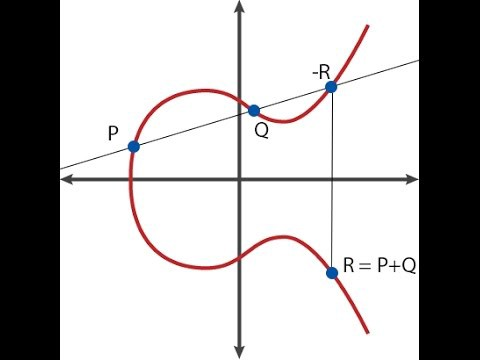
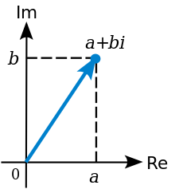
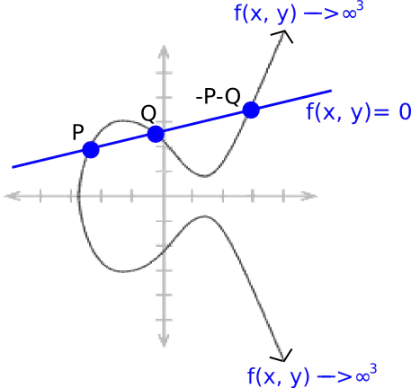

原文：[Exploring Elliptic Curve Pairings](https://medium.com/@VitalikButerin/exploring-elliptic-curve-pairings-c73c1864e627)

  <!--more-->

# 探索椭圆曲线配对

椭圆曲线配对是各种密码学构造背后的关键原语之一，包括确定性阈值签名，zk-SNARK 和其他更简单形式的零知识证明。 椭圆曲线配对(也叫“双线性映射”)有了30年的应用历史，然而最近这些年才把它应用在密码学领域。 配对引入了一种“加密乘法”形式，极大地扩展了基于椭圆曲线的协议的应用范围。 本文的目的是详细介绍椭圆曲线配对，并解释其工作原理的概述。
第一次阅读本文，你可能有点地方无法弄明白，甚至是第10次阅读，你也可能无法完全明白 但是希望本文至少可以使您对幕后发生的事情有所了解。

椭圆曲线本身是一个不容易理解的话题，本文通常假定您知道它们是如何工作的。 如果不这样做，我建议您在此作为入门文章：https://blog.cloudflare.com/a-relatively-easy-to-under-understand-primer-on-elliptic-curve-cryptography/。 简要总结一下，椭圆曲线密码学涉及称为“点”的数学对象（这些点是具有（x，y）坐标的二维点），它有自己特别的加法和减法规则（即，用于计算R = P + Q），也可以将一个点乘以一个整数（即P * n = P + P +…+ P，但是如果 n 很大的话，则有一种更快的计算方法）。




存在一个特殊的点，称为“无穷大点”（O），在点算术中即为零。 即 P + O = P。此外，曲线具有“阶数”；存在一个数字 n ，使得任何P都为P * n = O（当然，P *（n + 1）= P，P *（7 * n + 5）= P * 5，依此类推）。也有一些公认的“生成元” G，从某种意义上讲，生成元 G 代表数字1。理论上，曲线上的任何点（O除外）都可以是 G ，就看选择哪一个作为标准。
我们进一步看下配对，它们使您可以检查椭圆曲线点上某些更复杂的方程式——例如，如果 P = G * p，Q = G * q 和 R = G * r ，当我们只有 P，Q 和 R 作为输入时，也可以检查是否 p * q = r 。这种形式看起来似乎椭圆曲线的基本安全保证已被破坏，因为关于 p 的信息是在我们只知道 P 的情况下而泄漏的，而事实证明泄漏是高度包含的——具体来说，[决策Diffie Hellman问题](https://en.wikipedia.org/wiki/Decisional_Diffie%E2%80%93Hellman_assumption)很容易，但是计算 Diffie Hellman 问题（在上面的示例中知道 P 和 Q ，计算 R = G * p * q ）和离散对数问题（从 P 中恢复 p ）在计算上仍然不可行（至少在以前是这样）。

再进一步观察配对功能，也许对于我们所使用的大多数用例而言，最能说明问题的是，如果您将椭圆曲线点视为单向加密数字（即，encrypt（p） = p * G = P），则传统的椭圆曲线数学可以让我们检查数字的线性约束（例如，如果已知 P = G * p，Q = G * q 和 R = G * r ，则检查 5 * P + 7 * Q = 11 * R 实际上是在检查 5 * p + 7 * q = 11 * r ），而配对使我们可以检查二次约束（例如，检查e(P，Q) * e(G，G * 5) = 1 确实在检查 p * q + 5 = 0 ）。 升到二次就足以让我们使用确定性门限签名，QAP 和所有其他好东西。
现在，我们上面介绍的这个有趣的 e(P，Q) 运算符是什么？ 这就是配对。 数学家有时也称它为双线性图。 这里的“双线性”一词基本上意味着它满足约束条件：

$$e(P, Q + R) = e(P, Q) * e(P, R)$$

$$e(P + S, Q) = e(P, Q) * e(S, Q)$$

注意 + 和 $$*$$ 可以是任意运算符;当你创造奇特的新类型的数学对象时，抽象代数并不关心如何定义 + 和 $$*$$ ，只要它们与通常的运算方式保持一致就行，例如 a+b = b+a, $$ (a*b)*c = a*(b*c)$$ 以及 $$(a*c) + (b*c) = (a+b)*c$$ 。

如果 P， Q， R 是单纯的数字，那么做个配对就简单了：我们可以定义 e(x, y) = 2^{xy} ，那么我们可以看到：
 $$e(3, 4+5) = 2^{3*9} = 2^{27}$$
$$ e(3, 4)*e(3, 5) = 2^{3*4} * 2^{3*5} = 2^{12} * 2^{15} = 2^{27}$$

它是双线性的。

然而，这种简单的配对不适用于密码学，因为它们所处理的对象是简单的整数，并且很容易分析；整数使得除法、对数运算和各种其他的运算变得容易；简单整数没有“公钥”或“单向函数”的概念。此外，通过上述配对，我们可以进行反推—— 知道 x 和 e(x,y) ，就可以通过简单地除法和对数计算来确定 y 。我们希望数学对象尽可能接近“黑盒子”，你可以在其中进行加，减，乘和除，但不做任何其他事情。这正是椭圆曲线和椭圆曲线配对的作用。

------

事实证明，也可以在椭圆曲线点上制作双线性映射 ——即得出 e(P,Q) 函数，其中输入点 P 和 Q ，都是椭圆曲线点，并且输出是所谓的 F_p¹² 元素（至少在下面的情况下是这样的；具体情况因曲线细节而异，稍后会详细介绍），注意，这背后的数学非常复杂。

首先，让我们介绍素数域和扩展域。如果我们假设曲线方程是使用常规实数定义的，那么得到的椭圆曲线看上去就是像本文前面图片的那样。但是，如果我们真的在密码学中使用常规实数，那么你就可以轻易的使用对数运算进行反推，由此获得破解；此外，存储和表示数字所需的空间也会大幅增长。因此，我们改为使用素数域中的数字。

素数域由数字 0,1,2 ... p-1 构成的集合组成，其中 p 为素数，各种操作定义如下：

```undefined
a+b: (a+b) % p
a*b: (a*b) % p
a-b: (a-b) % p
a/b: (a*b^(p-2)) % p
```

基本上，所有数学都以模 p 形式完成（有关模运算的介绍，请[参见此处](https://www.khanacademy.org/computing/computer-science/cryptography/modarithmetic/a/what-is-modular-arithmetic)）。除法是一个特例；通常的运算中，3/2 的结果不是整数，然而这里我们只想处理整数，所以我们试图找到数 x，使得 x * 2 = 3 ，其中 * 是指如上定义的模乘。感谢 [Fermat小定理](https://en.wikipedia.org/wiki/Fermat's_little_theorem) ，里面给出的取幂技巧可以帮助我们完成了这个计算，但使用扩展欧几里得算法可以更快一些。假设 p = 7 ；这里有一些例子：

```undefined
2 + 3 = 5 % 7 = 5
4 + 6 = 10 % 7 = 3
2 - 5 = -3 % 7 = 4
6 * 3 = 18 % 7 = 4
3 / 2 = (3 * 2^5) % 7 = 5
5 * 2 = 10 % 7 = 3
```

如果你钻研一下这类数学计算，你会发现它是完备的并且满足所有通用的规则。上面的最后两个例子显示了 (a / b)* b = a ；你还可以看到(a + b)+ c = a +(b + c)，(a + b)* c = a * c + b * c，而且与你知道和喜爱的所有其他高中代数规律依然相符。在实际的椭圆曲线中，点和方程通常是在素数域中计算的。

现在，我们来谈谈扩展域。您之前可能已经看过一个扩展域；在数学教科书中遇到的最常见的例子是复数域，复数域实际上是，实数域加上 sqrt(-1)= i 的扩展。基本上，扩展域就是在现有域的基础上，“发明”一个新元素并定义该元素与现有元素之间的关系(比如，i²+ 1 = 0)，并确保此等式不适用于原有域中的任何数字，然后对现有域的元素和新创建的元素做一个线性组合。



我们也可以扩展素数域；例如，我们可以用 i 扩展我们上面描述的素数域 mod 7 ，然后我们可以这样做：

```go
(2 + 3i) + (4 + 2i) = 6 + 5i
(5 + 2i) + 3 = 1 + 2i
(6 + 2i) * 2 = 5 + 4i
4i * (2 + i) = 3 + i
```

最后一个计算结果可能有点难懂。我们首先将乘积分解为 4i * 2 + 4i * i ，得到 8i  -  4 ，然后因为我们在 mod 7  质数域中，所以进行mod 7 运算后，变成 i + 3 。接下来， 对于除法，我们可以这样：

```undefined
a / b:  (a * b^(p^2-2)) % p
```

请注意，在这里 Fermat小定理的指数是 p² 而不是 p ，但如果我们想要更高效，我们也可以通过扩展“扩展的欧几里得算法”来完成这项工作。注意，对于该域中的任何 x ，x ^（p² -  1）= 1 ，因此我们将 p² - 1 称为“该域中乘法群的阶”。

在实数域中，[代数的基本定理](https://en.wikipedia.org/wiki/Fundamental_theorem_of_algebra)保证了复数的二次扩展是“完备的” ——你不能再进一步扩展它了，因为对于任何数学关系（至少，由代数公式定义的任何数学关系），如果你增加了一个新的元素 j , 并观察它与现有复数的关系，你会发现总会有一个已经存在的复数满足了这种关系。然而对于素数域而言，不会有这样的问题，所以我们可以进一步做出三次扩展（其中一些新元素 w 和现有域元素之间的数学关系是一个三次方程，所以 1，w 和 w² 都是线性地并彼此独立），高阶扩展，扩展的扩展等。并且正是这种加强的、可求余的复数，构成了椭圆曲线配对的基础。

如果你想看下质数域和扩展域相关的数学计算及其代码实现，可以[参考这里](https://github.com/ethereum/research/blob/master/zksnark/bn128_field_elements.py)

------

现在，进入椭圆曲线配对的内容。椭圆曲线配对（或者更确切地说，我们将在这里探讨的是配对的具体形式；其实还有其他类型的配对，不过它们的逻辑都非常相似）是一个映射 G2 x G1  - > Gt ，其中

- G1 是一条椭圆曲线，它的点满足形如 y²=x³+ b 的等式，并且其中两个坐标都是 F_p 的元素（即，它们是简单的数字，不过，所有的算术运算都是对某个质数的模运算完成的）
- G2 也是一条椭圆曲线，它的点满足与 G1 相同的等式，不过，坐标是 F_p¹² 的元素（即它们是我们前面谈到的加强版的复数；我们定义一个新的“魔数” w ，它是由 12 次多项式定义的，如 `w ^ 12 - 18 * w ^ 6 + 82 = 0`）
- Gt 是椭圆曲线的结果所属的对象的类型。在我们当前的曲线中，Gt 是 F_p¹²（与 G2 中使用的是相同的加强版的复数）

它必须满足的主要特性是双线性，在这种情况下意味着：

- e(P, Q+R) = e(P, Q) * e(P, R)
- e(P+Q, R) = e(P, R) * e(Q, R)

这里有两个重要的标准：

- 高效的可计算性（例如，我们可以通过简单地获取所有点的离散对数并将它们相乘来进行简单的配对，但这与破解椭圆曲线加密的计算难度相同，因此这不可行）
- 不可退化性（当然，你可以定义 e(P,Q) = 1 ，但这不是一个特别有用的配对）

我们如何做到这两点呢？

------

配对函数背后的数学原理是非常棘手的，涉及到相当多的高等代数甚至超出了我们目前所见，但我将提供一个大纲。首先，我们需要定义除数的概念，它实际上是椭圆曲线上点的另一种函数表示方法。一个函数的除数基本上是计算这个函数的零和无穷大的个数。让我们来看几个例子。让我们已知点 P =（P_x，P_y） ，并考虑以下函数：
  f(x, y) = x - P_x 

这个除数是 [P] + [-P] - 2* [O] （这里的方括号是表示，点 P 存在于函数的零和无穷大所组成的集合中，不是指P点本身；[P] + [Q]与[P+Q]不是同一种东西）。原因如下：

- 这函数在 P 点的值是 0 ， 因为此时 x 等于 P_x ，代入 x - P_x = 0
- 这个函数在 -P 点的值也是 0 ， 因为 -P 和 P 的 x 坐标是相同的
- 当 x 趋近于无穷大的时候，这个函数也趋近去无穷大，所以我们说这个函数在 O 处是无穷大。这儿有一个问题，为什么这个无穷大需要计算两次，从而给 O 乘以 -2 呢？（取负是因为它是无穷大而不是零,2是说明计算了两次）

技术上的原因大概是这样的：因为这个曲线方程是 x³ = y² + b 。y 趋近于无穷大的速度比 x 快 1.5 倍，这样才能使得 y² 赶上 x³ ；因此，如果一个线性函数只包含 x ，那么它代表着无穷大乘以 2 ，但是如果它包含 y ，那么它就代表无穷大乘以 3 。

现在，考虑一个线性函数：

ax + by + c = 0

这里，a,b 和 c 都是精心选择的，使得这条直线经过点 P 和 Q 。因为这正是椭圆曲线加法的方式(看下面图的上方),这也就意味着，它经过 -P-Q ，而后趋向于无穷大，同时考虑到它包含 x 和 y ，所以它的除数就是： [P]+ [Q] + [-P-Q] - 3 * [O] 。



我们知道每个“有理函数”(是指在点坐标系中有有限的数字进行加减乘除运算得到的函数)都唯一对应某个除数，最多也不过是再乘以一个常数（例如：如果两个函数有相同的除数，那么就满足 F=G*k ，k 是某个常数）

对于任意两个函数 F 和 G ，$$ F*G$$ 的除数等于 F 的除数加上 G 的除数(在数学课本中，你会看到 (F*G) = (F)+(G) )，举个例子，如果 f(x, y) = P_x -x , 那么 (f³) = 3 * [P] + 3 * [-P] - 6 * [O] ;
 P 和 -P 计算了三次，是因为，在某种数学意义上， f³ 在这些点趋近于 0 的速度快了 3 倍。

现在，我们准备看一下 Tate 配对。考虑下面通过除数定义的函数：

- (F_P) = $$n*[P] - n*[O]$$，其中 n 是 G1 的阶，即对于任意的 P ，都有 n*P = O
- (F_Q) = $$n*[Q] - n*[O]$$
- (g) = [P+Q] - [P] -[Q] +[O]

现在我们看看这个乘积：F_P * F_Q * g^n 【译者注：利用上面的公式：$$(F*G) = (F)+(G)$$】。它的除数是：
 n*[P] - n*[O] + n*[Q] - n*[O] + n*[P+Q] - n*[P] -n*[Q] + n*[O]
 简化后变成：
 n*[P+Q] - n*[O]

注意，这个除数和上面F_P和F_Q的除数是同样的格式，因此：
 F_P * F_Q *g ^n = F_(P+Q)。

现在，我们引入一种过程，叫做“最终取幂”，我们把上面函数 (F_P，F_Q) 的结果增加 z 次幂， z = (p¹² - 1) / n, 其中 p¹² - 1 是 F_p¹² 乘法群的阶(即对于任意 xϵ F_p¹², x^(p¹² - 1) = 1 )。注意，如果你把这个幂应用到任何*已经*有 n 次幂的结果上，你将得到 p¹² - 1 次幂，所以结果就变成 1了。因此，在最终取幂之后，g^n 就抵消掉了，我们有 F_P^z * F_Q^z = F_(P+Q)^z 。这正是我们需要的双线性。

现在，如果你想在两个参数中创建一个双线性函数，你需要进入更加诡异的数学，不要直接取 F_P 中的一个值，而是取 F_P 中的数作为一个除数，这就是完整的“ Tate 配对”了。为了证明更多的结果，你必须处理像“线性等价”和“ Weil 互惠”这样的概念，由此打开新世界的大门。您可以在[这里](http://www.math.ru.nl/~bosma/Students/MScThesis_DennisMeffert.pdf)和[这里](http://people.cs.nctu.edu.tw/~rjchen/ECC2012S/Elliptic Curves Number Theory And Cryptography 2n.pdf)找到更多关于所有这些的阅读材料。

对于 Tate 配对的修改版本的实现，称为最佳 Ate 配对，请参见[此处](https://github.com/ethereum/research/blob/master/zksnark/bn128_pairing.py)。该代码实现了[Miller](https://crypto.stanford.edu/pbc/notes/ep/miller.html)的算法，这是实际计算 F_P 所需的。

------

请注意，像这样的配对事实上可能是一种混合的祝福：一方面，它意味着我们可以用配对做的所有协议都能实现，但也意味着我们必须更加小心的选择椭圆曲线。

每一个椭圆曲线都有一个叫做“嵌入度”的值；即，使得 p ^ k-1 是 n 的倍数（其中p是用于域的素数，n是曲线的阶），满足这一要求的最小的 k 。在上面的域中，k = 12，并且在用于传统ECC的应用场景中（即，我们不关心配对），嵌入度通常非常大，以至于配对在计算上是不可行的；但是，如果我们不小心，就可能生成 k = 4 或甚至 k=1 的域。

如果 k = 1 ，那么椭圆曲线的“离散对数”问题（即，只知道点 P = G * p 从而反推 p ，你需要解决的问题是“破解”椭圆曲线私钥）可以减少进入类似于 F_p 的数学问题，问题变得更容易（这称为 [MOV攻击](https://crypto.stanford.edu/pbc/notes/elliptic/movattack.html)）;使用嵌入度为 12 或更高的曲线确保这种减少不可用，或者解决配对结果中的离散对数问题至少与从公共密钥“正常”恢复私钥一样困难（即，计算上是不可行的）。别担心，所有标准曲线已针对此问题彻底检查了参数。

之后我会写一篇博文，对 zk-SNARKs 的工作原理的数学解释，敬请期待。

