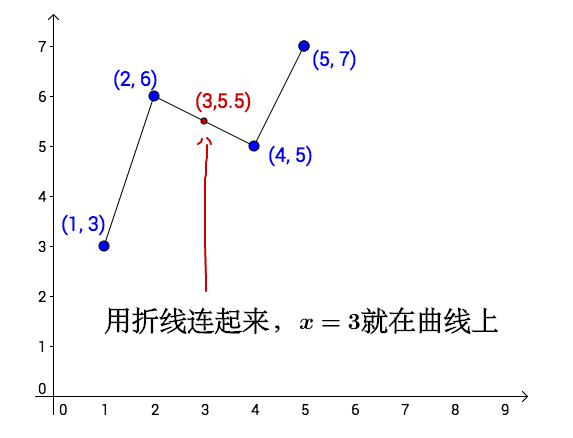
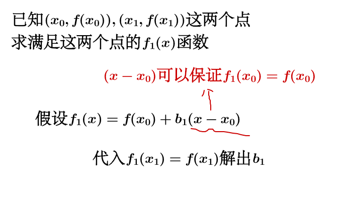
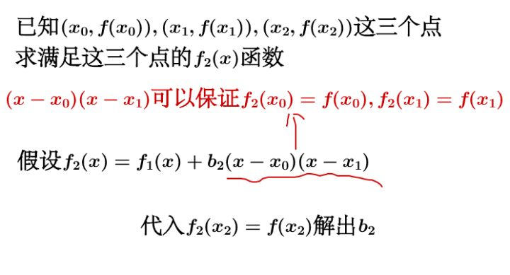

插值法的**中心思想**就是：

**在我们已具备一组 KV 键值对的情况下，如何得出还没被定到的区域的值**

使用插值法所建立的函数，在构造的函数中一定要重现原本给定的 KV 键值对，否则就不是插值法而是函数近似或者曲线拟合的问题了

插值的做法，直观来讲就是：

1. 先从 KV 键值对来获得函数 f(x)

2. 用函数 f(x) 求出我们所要的任何特定 x 之 f(x )  函数值。

<!--more-->

然而，比较精密且系统化的数值方法却不是用这两个步骤来进行插值，原因是前述两阶段方法**对于插值的精密度并没有控制**，效率较差，也比较会有进位误差。一般在做插值法，是从欲插值点 x 附近的几个 KV 键值对 xi 开始，建立插值函数 f(x) ，并且也试着网罗更多 KV 键值对来插值，看随着项数变多误差会不会变小，如此找出最适合的函数 f(x) 。

## 线性插值法

所有的插值法里面最简单的莫过于线性插值法，任两个相邻的点之间必可以拉一条直线把它们连起来，如此在之间的 x 值就都有线性函数 y(x ) 可以对应到，利用直线上的斜率必为固定值的特性

## 多项式插值法

现存的各种多项式插值法最终都是通过假设多项式方程求解方程参数的问题，也就是矩阵求解的问题。

### 线性方程

假设我们现在已知 k 个在二维平面上的点，那么我们可以连立这些点组成一个 k-1 次的方程组，从而解出这个方程组的各个系数。

例如：

 ![[公式]](https://www.zhihu.com/equation?tex=y%3DAx%5E2%2BBx%2BC)

当我们有3个点的时候，我们联立的方程是

![[公式]](https://www.zhihu.com/equation?tex=%5Cbegin%7Balign%7D+Ax_0%5E2%2BBx_0%2BC%26%3Dy_0%5C%5C+Ax_1%5E2%2BBx_1%2BC%26%3Dy_1%5C%5C+Ax_2%5E2%2BBx_2%2BC%26%3Dy_2+%5Cend%7Balign%7D)

*变为矩阵求解问题，结合**克莱姆法则(Cramer‘s Rule)** 我们可以很快得出*
![[公式]](https://www.zhihu.com/equation?tex=A%3D%5Cfrac%7B%5Cbegin%7Bvmatrix%7D+y_0+%26+x_0+%26+1+%5C%5C+y_1+%26+x_1+%26+1+%5C%5C+y_2+%26+x_2+%26+1+%5Cend%7Bvmatrix%7D%7D%7B%5Cbegin%7Bvmatrix%7D+x_0%5E2+%26+x_0+%26+1+%5C%5C+x_1%5E2+%26+x_1+%26+1+%5C%5C+x_2%5E2+%26+x_2+%26+1+%5Cend%7Bvmatrix%7D%7D%2C%5C+B%3D%5Cfrac%7B%5Cbegin%7Bvmatrix%7D+x_0%5E2+%26+y_0+%26+1+%5C%5C+x_1%5E2+%26+y_1+%26+1+%5C%5C+x_2%5E2+%26+y_2+%26+1+%5Cend%7Bvmatrix%7D%7D%7B%5Cbegin%7Bvmatrix%7D+x_0%5E2+%26+x_0+%26+1+%5C%5C+x_1%5E2+%26+x_1+%26+1+%5C%5C+x_2%5E2+%26+x_2+%26+1+%5Cend%7Bvmatrix%7D%7D%2C%5C+C%3D%5Cfrac%7B%5Cbegin%7Bvmatrix%7D+x_0%5E2+%26+x_0+%26+y_0+%5C%5C+x_1%5E2+%26+x_1+%26+y_1+%5C%5C+x_2%5E2+%26+x_2+%26+y_2+%5Cend%7Bvmatrix%7D%7D%7B%5Cbegin%7Bvmatrix%7D+x_0%5E2+%26+x_0+%26+1+%5C%5C+x_1%5E2+%26+x_1+%26+1+%5C%5C+x_2%5E2+%26+x_2+%26+1+%5Cend%7Bvmatrix%7D%7D)

以上公式可用的前提是分母不为0，很多资料中在提到插值算法的时候要求各个点互异也是这个原因。实际上这间接证明了插值函数在一定次数上的解的唯一性，如果我们刚刚假设的是一个3次多项式，却只有3个点，方程就变为了3行4列，解是无穷的。因此我们才可以说在 ![[公式]](https://www.zhihu.com/equation?tex=n) 个点互异的情况下可以确定唯一一个 ![[公式]](https://www.zhihu.com/equation?tex=n-1) 次多项式。

但是线性方程组在实际应用中是有重大缺陷的：

1. 计算量大，如果是几万几十万的数据量，方程组的解将会非常耗时。
2. 如果要新增加一组数据，整个方程组就会发生改变，要重新计算

于是乎，我们引入了**牛顿插值法**

### 牛顿插值法

牛顿插值法的特点在于：**每增加一个点，不需要推翻之前的计算，只需要计算和新增加的点相关的多项式就可以了。**

假设已知 ![[公式]](https://www.zhihu.com/equation?tex=n%2B1) 个点相对多项式函数 ![[公式]](https://www.zhihu.com/equation?tex=f) 的值为：![[公式]](https://www.zhihu.com/equation?tex=%28x_0%2Cf%28x_0%29%29%2C%28x_1%2Cf%28x_1%29%29%2C%28x_2%2Cf%28x_2%29%29%2C+%5Ccdots+%2C%28x_+n%2Cf%28x_+n%29%29) ，求此多项式函数 ![[公式]](https://www.zhihu.com/equation?tex=f) 。

先从求满足两个点 ![[公式]](https://www.zhihu.com/equation?tex=%28x_0%2Cf%28x_0%29%29%2C%28x_1%2Cf%28x_1%29%29) 的函数 ![[公式]](https://www.zhihu.com/equation?tex=f_1%28x%29) 说起：

假设 ![[公式]](https://www.zhihu.com/equation?tex=f_1%28x%29%3Df%28x_0%29%2Bb_1%28x-x_0%29) ，

令 ![[公式]](https://www.zhihu.com/equation?tex=f_1%28x_1%29%3Df%28x_1%29) ：

![[公式]](https://www.zhihu.com/equation?tex=%5Cbegin%7Balign%2A%7D+%26+%5Cimplies+b_1%3D%5Cfrac%7Bf%28x_1%29-f%28x_0%29%7D%7Bx_1-x_0%7D+%5C%5C+%26+%5Cimplies+f_1%28x%29%3Df%28x_0%29%2B%5Cfrac%7Bf%28x_1%29-f%28x_0%29%7D%7Bx_1-x_0%7D%28x-x_0%29+%5Cend%7Balign%2A%7D%5C%5C)

现在我们增加一个点， ![[公式]](https://www.zhihu.com/equation?tex=%28x_0%2Cf%28x_0%29%29%2C%28x_1%2Cf%28x_1%29%29%2C%28x_2%2Cf%28x_2%29%29) ，求满足这三个点的函数 ![[公式]](https://www.zhihu.com/equation?tex=f_2%28x%29)：

假设 ![[公式]](https://www.zhihu.com/equation?tex=f_2%28x%29%3Df_1%28x%29%2Bb_2%28x-x_0%29%28x-x_1%29) ，

令 ![[公式]](https://www.zhihu.com/equation?tex=f_2%28x_2%29%3Df%28x_2%29)：

![[公式]](https://www.zhihu.com/equation?tex=%5Cbegin%7Balign%2A%7D+%26+%5Cimplies+b_2%3D%26+%26+%5Cfrac%7B%5B%5Cfrac%7Bf%28x_2%29+-+f%28x_1%29%7D%7Bx_2+-+x_1%7D%5D+-+%5B%5Cfrac%7Bf%28x_1%29+-+f%28x_0%29%7D%7Bx_1+-+x_0%7D%5D%7D%7Bx_2+-+x_0%7D+%5C%5C+%26+%5Cimplies+f_2%28x%29+%3D+%26+%26+f%28x_0%29%2B%5Cfrac%7Bf%28x_1%29-f%28x_0%29%7D%7Bx_1-x_0%7D%28x-x_0%29+%5C%5C+%26+%26+%26+%2B%5Cfrac%7B%5B%5Cfrac%7Bf%28x_2%29+-+f%28x_1%29%7D%7Bx_2+-+x_1%7D%5D+-+%5B%5Cfrac%7Bf%28x_1%29+-+f%28x_0%29%7D%7Bx_1+-+x_0%7D%5D%7D%7Bx_2+-+x_0%7D%28x-x_0%29%28x-x_1%29+%5Cend%7Balign%2A%7D%5C%5C)

![[公式]](https://www.zhihu.com/equation?tex=b_1%2Cb_2) 看起来蛮有特点的，我们把特点提炼一下。

一阶均差：

![[公式]](https://www.zhihu.com/equation?tex=f%5Bx_+i%2Cx_+j%5D%3D%5Cfrac%7Bf%28x_+i%29-f%28x_+j%29%7D%7Bx_+i-x_+j%7D%2Ci%5Cne+j%5C%5C)

二阶均差是一阶均差的均差：

![[公式]](https://www.zhihu.com/equation?tex=f%5Bx_+i%2Cx_+j%2Cx_+k%5D%3D%5Cfrac%7Bf%5Bi%2Cj%5D-f%5Bj%2Ck%5D%7D%7Bx_+i-x_+k%7D%2Ci%5Cne+j%5Cne+k%5C%5C)

三阶均差就是二阶均差的均差，以此类推，我们得到牛顿插值法为：

![[公式]](https://www.zhihu.com/equation?tex=%5Cbegin%7Balign%2A%7D+f%28x%29+%3D%26+f%28%7Bx_0%7D%29+%2B+f%5B%7Bx_0%7D%2C%7Bx_1%7D%5D%28x+-+%7Bx_0%7D%29+%5C%5C+%26+%2B+f%5B%7Bx_0%7D%2C%7Bx_1%7D%2C%7Bx_2%7D%5D%28x+-+%7Bx_0%7D%29%28x+-+%7Bx_1%7D%29+%2B%5Ccdots+%5C%5C+%26+%2B+f%5B%7Bx_0%7D%2C%7Bx_1%7D%2C+%5Ccdots+%2C%7Bx_%7Bn+-+2%7D%7D%2C%7Bx_%7Bn+-+1%7D%7D%5D%28x+-+%7Bx_0%7D%29%28x+-+%7Bx_1%7D%29+%5Ccdots+%28x+-+%7Bx_%7Bn+-+2%7D%7D%29%28x+-+%7Bx_%7Bn+-+1%7D%7D%29+%5C%5C+%26+%2B+f%5B%7Bx_0%7D%2C%7Bx_1%7D%2C+%5Ccdots+%2C%7Bx_%7Bn+-+1%7D%7D%2C%7Bx_+n%7D%5D%28x+-+%7Bx_0%7D%29%28x+-+%7Bx_1%7D%29+%5Ccdots+%28x+-+%7Bx_%7Bn+-+1%7D%7D%29%28x+-+%7Bx_+n%7D%29+%5Cend%7Balign%2A%7D%5C%5C)

计算通过下面这个示意图进行，就会很简单：

新增一个点就只需要计算相关的差分就可以了：

### 拉格朗日插值法

### 泰勒公式

泰勒把牛顿插值法做了一些改造。

首先，设 ![[公式]](https://www.zhihu.com/equation?tex=f%28x%29) 是一个函数，它在 ![[公式]](https://www.zhihu.com/equation?tex=x_0%2Cx_0%2B%5CDelta+x%2Cx_0%2B2%5CDelta+x%2Cx_0%2B3%5CDelta+x%2C%5Ccdots+%2Cx_0%2Bn%5CDelta+x) 的值已知（和之前的相比，相当于每个点都是等距离间隔的，间隔 ![[公式]](https://www.zhihu.com/equation?tex=%5CDelta+x) ），令：

![[公式]](https://www.zhihu.com/equation?tex=%5CDelta+f%28x_0%29%3Df%28x_0%2B%5CDelta+x%29-f%28x_0%29) ，也称为一阶差分，

![[公式]](https://www.zhihu.com/equation?tex=%5CDelta+f%28x_0%2B%5CDelta+x%29%3Df%28x_0%2B2%5CDelta+x%29-f%28x_0%2B%5CDelta+x%29) ，

![[公式]](https://www.zhihu.com/equation?tex=%5CDelta+f%28x_0%2B2%5CDelta+x%29%3Df%28x_0%2B3%5CDelta+x%29-f%28x_0%2B2%5CDelta+x%29)

进一步令：

![[公式]](https://www.zhihu.com/equation?tex=%5CDelta+%5E2+f%28x_0%29%3D%5CDelta+f%28x_0%2B%5CDelta+x%29-%5CDelta+f%28x_0%29) ，也称为二阶差分（为一阶差分的差分）

![[公式]](https://www.zhihu.com/equation?tex=%5CDelta+%5E3+f%28x_0%29%3D%5CDelta+%5E2+f%28x_0%2B%5CDelta+x%29-%5CDelta+%5E2+f%28x_0%29) ，也称为三阶差分。

做了这些假设之后我们来看看之前提到的 ![[公式]](https://www.zhihu.com/equation?tex=b_1) 会变成什么样子：

![[公式]](https://www.zhihu.com/equation?tex=b_1%3D%5Cfrac%7Bf%28x_1%29-f%28x_0%29%7D%7Bx_1-x_0%7D%5Cimplies+b1%3D%5Cfrac%7B%5CDelta+f%28x_0%29%7D%7B%5CDelta+x%7D%5C%5C)

而 ![[公式]](https://www.zhihu.com/equation?tex=f_1%28x%29) 会变成：

![[公式]](https://www.zhihu.com/equation?tex=f_1%28x%29%3Df%28x_0%29%2B%5Cfrac%7Bf%28x_1%29-f%28x_0%29%7D%7Bx_1-x_0%7D%28x-x_0%29%5Cimplies+f_1%28x%29%3Df%28x_0%29%2B%5Cfrac%7B%5CDelta+f%28x_0%29%7D%7B%5CDelta+x%7D%28x-x_0%29%5C%5C)

同样的 ![[公式]](https://www.zhihu.com/equation?tex=f_2%28x%29) 就变成了：

![[公式]](https://www.zhihu.com/equation?tex=f_2%28x%29%3Df%28x_0%29%2B%5Cfrac%7B%5CDelta+f%28x_0%29%7D%7B%5CDelta+x%7D%28x-x_0%29%2B%5Cfrac%7B%5CDelta+%5E2+f%28x_0%29%7D%7B2%5CDelta+x%7D%28x-x_0%29%28x-x_1%29%5C%5C)

泰勒断言，当 ![[公式]](https://www.zhihu.com/equation?tex=%5CDelta+x%3D0) 时：

![[公式]](https://www.zhihu.com/equation?tex=f_1%28x%29%3Df%28x_0%29%2Bf%27%28x_0%29%28x-x_0%29%5C%5C)

![[公式]](https://www.zhihu.com/equation?tex=f_1%28x%29%3Df%28x_0%29%2Bf%27%28x_0%29%28x-x_0%29%2B%5Cfrac%7Bf%27%27%28x_0%29%7D%7B2%21%7D%28x-x_0%29%5E2%5C%5C)

（ ![[公式]](https://www.zhihu.com/equation?tex=%5CDelta+x%3D0) 时有 ![[公式]](https://www.zhihu.com/equation?tex=x-x_1%3Dx-x_0) ）

以此类推泰勒就得到了大名鼎鼎的泰勒公式：

![[公式]](https://www.zhihu.com/equation?tex=f%28x%29%3Df%28x_0%29%2Bf%27%28x_0%29%28x-x_0%29%2B%5Cfrac%7Bf%27%27%28x_0%29%7D%7B2%21%7D%28x-x_0%29%5E2%2B%5Ccdots+%5C%5C)

## Reference

1. [牛顿插值的几何解释是怎么样的](https://www.zhihu.com/question/22320408)
2. [如何直观的理解拉格朗日插值法](https://www.zhihu.com/question/58333118)
3. [如何通俗地解释泰勒公式](https://www.zhihu.com/question/21149770)