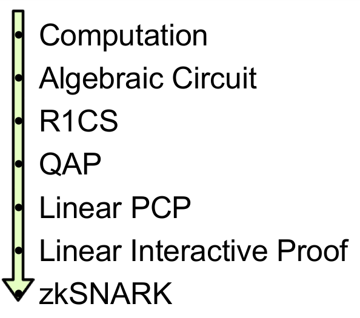

原文：[Quadratic Arithmetic Programs: from Zero to Hero](https://medium.com/@VitalikButerin/quadratic-arithmetic-programs-from-zero-to-hero-f6d558cea649)

# 由浅入深入门 QAP



上述步骤应该被分成两部分。首先，zk-SNARKs 无法直接应用到任何计算问题上;相反，为了解决问题，你必须将问题转换为适当的"形式"，即 “二次算术程序”（QAP），这种形式的转换本身就不是一件容易的事情。除了将函数的代码转换为 QAP 之外，一起运行的还有另一个过程，这样，如果对代码有输入，就可以创建相应的解决方案(有时称为 QAP 的“见证”)。在此之后，还有另一个相当复杂的过程来为这个 QAP 创建实际的“零知识证明”，还有一个单独的过程来验证别人传给你的证据，但是这些细节超出了本文的范围。

在下面示例中，我们将选择一个非常简单的问题：求一个三次方程的解: $$x^3 + x + 5 == 35$$ (提示:答案是 3 )。
这个问题很简单，但是重要的，你可以由此案例看到所有的功能是如何发挥作用的。

用编程语言描述以上方程如下：

```python
def qeval(x):
    y = x**3
    return x + y + 5
```

我们在这里使用的简单编程语言支持基本的四则运算 (+、-、*、/) 、恒等幂指数 ($$x^7，但不是x^y$$) 和变量赋值，理论上这足以强大到可以借此进行任何计算(只要计算步骤的数量是有界的;且不允许循环)。注意模 (%) 和比较运算符 (<、>、≤≥) 是不支持,因为没有有效的方法取模或直接比较有限循环群算法 (感谢;如果有任何一种方法可以做到这一点，那么椭圆曲线密码破环的速度将超过“二分查找”和“中国剩余定理”) 。

同时你也可以利用位分解来实现取模和比较运算，（例如：$$13 = 2^3 + 2^2 + 1=8+4+1$$) 作为辅助输入，以证明这些分解的正确性，并可以借助**二进制电路**中进行数学运算；在有限域算法中，执行等式检查 (==) 也是可行的，甚至更容易一些，但这些细节我们现在都不讨论。我们也可以通过扩展来支持条件句（例如将语句：`if x < 5: y = 7; else: y = 9;` 转换为算术形式：`y = 7 * (x < 5) + 9 * (x >= 5);`）不过请注意，条件中的两条“路径”都需要执行，如果您有许多嵌套的条件，那么这会导致大量开销。

现在让我们一步一步地经历这个过程。如果你想自己做任何代码，我[在这里用Python实现了一段代码](https://github.com/ethereum/research/tree/master/zksnark)（仅用于教育目的；还没有准备好为现实世界的zk-SNARK制作QAPs !）

## 拍平

第一步是一个“拍平”的过程，我们把原来的代码（这可能包含任意复杂的语句和表达式）分解为最简单的表达式，这种表达式有两种形式:
 1- `x = y` （ y 可以是变量或数字)
 2- `x = y(op)z` ( op 可以 +,-,*,/，y 和 z 可以是变量，数字或子表达式)。

你可以把这些表述看成是电路中的逻辑门。上述表达式`x**3 + x + 5`的扁平化过程结果如下:


```csharp
sym_1 = x * x
y = sym_1 * x //相当于实现了幂函数y = x**3
sym_2 = y + x
~out = sym_2 + 5
```

你可以认为上述的每一行声明都是一个电路中的逻辑门，与原始代码相比，这里我们引入了两个中间变量`sym_1` 和 `sym_2`，还有一个表示输出的冗余变量 `~out`，不难看出“拍平”后的代码和原始代码是等价的。

