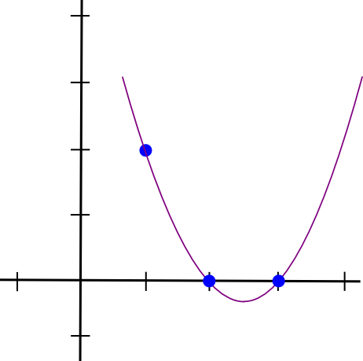
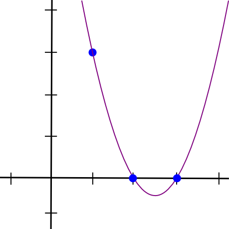
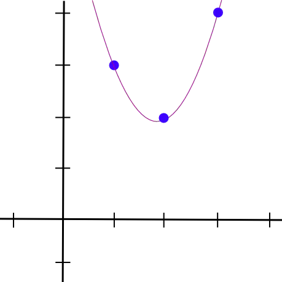

原文：[Quadratic Arithmetic Programs: from Zero to Hero](https://medium.com/@VitalikButerin/quadratic-arithmetic-programs-from-zero-to-hero-f6d558cea649)

  <!--more-->

# 由浅入深入门 QAP


上述步骤应该被分成两部分。首先，zk-SNARKs 无法直接应用到任何计算问题上;相反，为了解决问题，你必须将问题转换为适当的"形式"，即 “二次算术程序”（QAP），这种形式的转换本身就不是一件容易的事情。除了将函数的代码转换为 QAP 之外，一起运行的还有另一个过程，这样，如果对代码有输入，就可以创建相应的解决方案(有时称为 QAP 的“见证”)。在此之后，还有另一个相当复杂的过程来为这个 QAP 创建实际的“零知识证明”，还有一个单独的过程来验证别人传给你的证据，但是这些细节超出了本文的范围,就不在细述了。

在下面示例中，我们将选择一个非常简单的问题：求一个三次方程的解: $$x^3 + x + 5 == 35$$ (提示:答案是 3 )。
这个问题很简单，但是重要的，你可以由此案例看到所有的功能是如何发挥作用的。

用编程语言描述以上方程如下：

```python
def qeval(x):
    y = x**3
    return x + y + 5
```

我们在这里使用的简单编程语言支持基本的四则运算 (+、-、*、/) 、恒等幂指数 ($$x^7，但不是x^y$$) 和变量赋值，理论上这足以强大到可以借此进行任何计算(只要计算步骤的数量是有界的;且不允许循环)。注意模 (%) 和比较运算符 (<、>、≤≥) 是不支持，这是因为在有限循环群里面，没有求余运算和比较运算的高效方案 (幸亏如此，如果有任何一种方法可以做到这一点，那么椭圆曲线密码破环的速度将超过“二分查找”和“中国剩余定理”) 。

同时你也可以利用位分解来实现取模和比较运算，（例如：$$13 = 2^3 + 2^2 + 1=8+4+1$$) 作为辅助输入，以证明这些分解的正确性，并可以借助**二进制电路**中进行数学运算；在有限域算法中，执行等式检查 (==) 也是可行的，甚至更容易一些，但这些细节我们现在都不讨论。我们也可以通过扩展来支持条件句（例如将语句：`if x < 5: y = 7; else: y = 9;` 转换为算术形式：`y = 7 * (x < 5) + 9 * (x >= 5);`）不过请注意，条件中的两条“路径”都需要执行，如果您有许多嵌套的条件，那么这会导致大量开销。

现在让我们一步一步地经历这个过程。如果你想自己做任何代码，我[在这里用Python实现了一段代码](https://github.com/ethereum/research/tree/master/zksnark)（仅用于教育目的；还没有准备好为现实世界的 zk-SNARKs 制作 QAPs  !）

## 拍平

第一步是一个“拍平”的过程，我们把原来的代码（这可能包含任意复杂的语句和表达式）分解为最简单的表达式，这种表达式有两种形式:
 1- `x = y` （ y 可以是变量或数字)
 2- `x = y(op)z` ( op 可以 +,-,*,/，y 和 z 可以是变量，数字或子表达式)。

你可以把这些表述看成是电路中的逻辑门。上述表达式`x**3 + x + 5`的扁平化过程结果如下:


```csharp
sym_1 = x * x
y = sym_1 * x //相当于实现了幂函数y = x**3
sym_2 = y + x
~out = sym_2 + 5
```

你可以认为上述的每一行声明都是一个电路中的逻辑门，与原始代码相比，这里我们引入了两个中间变量`sym_1` 和 `sym_2`，还有一个表示输出的冗余变量 `~out`，不难看出“拍平”后的代码和原始代码是等价的。

## 转化为 R1CS

现在，我们把它转换成一个称为`R1CS`（Rand-1 Constraint System）的东西。`R1CS`是由三个向量`(a, b, c)`组成的序列，假设`R1CS`的解是一个向量`s`，其中`s`必须满足等式 $$s \cdot a * s \cdot b - s \cdot c = 0$$ ，其中 $$\cdot$$ 代表的是**内积运算**（将两个向量对应位置的成员相乘，结果再累加）。例如，下面是一个完美的 R1CS ：


但是上述例子只有一个约束，我们需要把它衍生到多个约束：接下来我们要将每个逻辑门（即 “拍平” 后的每一个声明语句）转化成一个约束（即一个`(a, b, c)`三向量组），转化的方法取决于声明是什么四则运算 (+,-,*,/) 和声明的参数是变量还是数字。每个向量的长度等于在系统中变量的个数，包括还需要在第一个分量位置处引入一个冗余变量`~one`来表示数字1，输入的变量，以及冗余变量 `~out` ，还有中间变量。就我们这个系统而言，一个向量所对应的 6 个分量是(可以是其他顺序，只要对应起来即可)：

```bash
'~one', 'x', '~out', 'sym_1', 'y', 'sym_2'
```

解向量就会按照上述顺序包含这些变量。

现在我们举一个例子：

在第一个门中 $$sym_1 = x * x$$ ：

```matlab
a = [0, 1, 0, 0, 0, 0]
b = [0, 1, 0, 0, 0, 0]
c = [0, 0, 0, 1, 0, 0]
```

如果解向量 `s` 的第二个标量是 3，第四个标量是 9，无论其他标量是多少，都成立，因为：a = 3 * 1, b = 3 * 1, c = 9 * 1，即`a * b = c`。同样，如果 s 的第二个标量是 7，第四个标量是 49，也会通过检查，第一次检查仅仅是为了验证第一个门的输入和输出的一致性。

而第二个门中 $$y = sym_1 * x$$ ：

```matlab
a = [0, 0, 0, 1, 0, 0]
b = [0, 1, 0, 0, 0, 0]
c = [0, 0, 0, 0, 1, 0]
```

同理，第三个门 $$sym_2 = y + x$$ ：

```matlab
a = [0, 1, 0, 0, 1, 0]
b = [1, 0, 0, 0, 0, 0] 
c = [0, 0, 0, 0, 0, 1]
```

第四个门 $$~out = sym_2 + 5$$ ：

```matlab
a = [5, 0, 0, 0, 0, 1]
b = [1, 0, 0, 0, 0, 0]
c = [0, 0, 1, 0, 0, 0]
```

现在，我们假设`x = 3`，根据第一个门，得到`sym_1 = 9`，根据第二个门得到`y = 27`，根据第三个门，得到`sym_2 = 30`，根据第四个门得到`~out = 35`，因此，根据：`'~one', 'x', '~out', 'sym_1', 'y', 'sym_2'`，可以得到：s = [1, 3, 35, 9, 27, 30] 。

如果假设不同的 x ，都可以得到不同的 s ，但所有 s 都可以用来验证 (a, b, c) 

现在我们得到了四个约束的 R1CS ，完整的 R1CS 如下：

```matlab
A
[0, 1, 0, 0, 0, 0]
[0, 0, 0, 1, 0, 0]
[0, 1, 0, 0, 1, 0]
[5, 0, 0, 0, 0, 1]

B
[0, 1, 0, 0, 0, 0]
[0, 1, 0, 0, 0, 0]
[1, 0, 0, 0, 0, 0]
[1, 0, 0, 0, 0, 0]

C
[0, 0, 0, 1, 0, 0]
[0, 0, 0, 0, 1, 0]
[0, 0, 0, 0, 0, 1]
[0, 0, 1, 0, 0, 0]
```

## 从 R1CS 到 QAP

下一步是将这个`R1CS`转换成`QAP`的形式，它们的底层逻辑是相同的，只是 QAP 使用多项式来代替了内积。我们是这样做的：将 4 组长度为 6 的 3 个向量转化为 6 组 长度为 3 的三次多项式，在每个 x 坐标处这些多项式的结果代表一个约束条件。也就是说，如果我们求出 x=1 处的多项式，我们就得到了第一组向量，如果我们求出 x=2 处的多项式，我们就得到第二组向量，以此类推。

我们可以用拉格朗日插值来做这个变换。拉格朗日插值法解决的问题是：如果你有一组点(即 (x, y) 坐标对），然后对这些点做拉格朗日插值得到一个经过所有这些点的多项式。我们通过分解问题：对于每个 x 坐标，我们都构建这样一个多项式，使得该多项式通过（x,y）这个点同时对于其他的点通过的都是 y=0 的点，最终我们将这样的多项式累加起来就可以得到我们想要的多项式了。

让我们举一个例子。假设我们想要一个多项式经过(1,3),(2,2)和(3,4)。我们首先做一个多项式，经过(1,3)(2,0)和(3,0)。事实证明，构建一个在 x=1 时不为 0 而在剩下两点 y 均为 0 的多项式是很容易的，我们只要做以下多项式即可：

```
(x - 2) * (x - 3)
```

如下图：



然后，在 y 轴方向“拉伸”，使用如下方程：

```
(x - 2) * (x - 3) * 3 / ((1 - 2) * (1 - 3))
```

得出：

$$y=1.5x^2-7.5x+9$$



然后我们在对另外两个点也做相似的操作。最后我们把三个多项式相加，可以得到：

$$y=1.5x^2-5.5x+7$$



就是我们想要的坐标方程。上述算法需要 $$O(n^3)$$ 时间复杂度，因为有 n 个点，每个点都需要 $$O(n^2)$$ 时间将多项式相乘。稍微思考一下，这就可以减少到 $$O(n^2)$$ 的时间，再多思考一下，使用快速的傅里叶变换算法等等，它可以进一步减少时间复杂度——这是一个关键的优化，因为在 zk- SNARKS 中使用的函数通常有成千上万个门。

现在我们使用拉格朗日差值公式来将 R1CS 转化为 QAP 形式。我们先求出四个约束所对应的每个 a 向量的第一个值的多项式，也就是说使用拉格朗日插值定理求过点 (1,0), (2,0), (3,0), (4,0) 的多项式，类似的我们可以求出其余的四个约束所对应的每个向量的第 i 个值的多项式。
这里，直接给出答案：

```matlab
A polynomials
[-5.0, 9.166, -5.0, 0.833]
[8.0, -11.333, 5.0, -0.666]
[0.0, 0.0, 0.0, 0.0]
[-6.0, 9.5, -4.0, 0.5]
[4.0, -7.0, 3.5, -0.5]
[-1.0, 1.833, -1.0, 0.166]
B polynomials
[3.0, -5.166, 2.5, -0.333]
[-2.0, 5.166, -2.5, 0.333]
[0.0, 0.0, 0.0, 0.0]
[0.0, 0.0, 0.0, 0.0]
[0.0, 0.0, 0.0, 0.0]
[0.0, 0.0, 0.0, 0.0]
C polynomials
[0.0, 0.0, 0.0, 0.0]
[0.0, 0.0, 0.0, 0.0]
[-1.0, 1.833, -1.0, 0.166]
[4.0, -4.333, 1.5, -0.166]
[-6.0, 9.5, -4.0, 0.5]
[4.0, -7.0, 3.5, -0.5]
```

这些系数是升序排序的，例如上述第一个多项式是 $$0.833 x^3 - 5 x^2 + 9.166  x - 5$$ 。这组多项式（加上将在后面解释的 Z 多项式）构成了此特定 QAP 实例的参数。 请注意，对于您要使用 zk-SNARKs 进行验证的每个功能，到目前为止所有工作都只需完成一次。 一旦生成了 QAP 参数，就可以重用它们。

我们尝试评估所有这些多项式在 x = 1 的情况。 在 x = 1 处评估多项式只是意味着将所有系数相加（对于所有 k，因为 $$1^k = 1$$ ），所以并不困难。 我们得到：

```undefined
A results at x=1
0
1
0
0
0
0
B results at x=1
0
1
0
0
0
0
C results at x=1
0
0
0
1
0
0
```

我们在这里拥有的与我们在上面创建的第一个逻辑门的三个向量的集合完全相同。

## 检查 QAP

那么这种疯狂转换的意义何在？ 答案是，我们现在可以通过对多项式进行点积检查来同时检查所有约束，而不是单独检查R1CS中的约束。


因为在这种情况下，点积的检查是多项式的一系列加法和乘法，所以结果本身就是多项式。如果之前我们用来表示逻辑门的每个 x 坐标处求值的所得多项式等于零，则意味着通过了所有检查；如果所得的多项式至少在代表逻辑门的 x 坐标之一中求值给出非零值，则意味着进出该逻辑门的值不一致（即门为y = x * sym_1，但提供的值可能是x = 2，sym_1 = 2和y = 5）。
请注意，所得多项式本身不必为零，实际上在大多数情况下不必为零。只要在与某个逻辑门相对应的所有点的结果均为零，它就可以在不与任何逻辑门相对应的点处具有任何行为。为了检查正确性，我们实际上并未在对应每个门的每个点处计算多项式 $$t = A \cdot s * B \cdot s - C \cdot s$$ ；取而代之的是，我们将 t 除以另一个多项式 Z ，然后检查 Z 是否整除了 t ——也就是说，除法 t / Z 没有余数。
Z 定义为$$（x-1）*（x-2）*（x-3）...$$ ——在对应于逻辑门的所有点上等于零的最简单多项式。基础的代数知识告诉我们，在所有这些点上等于零的多项式都必须是该最小多项式的倍数，并且如果多项式是 Z 的倍数，则在这些点上任何一个的求和都将为零；这种对等关系使我们的工作更加轻松。
现在，让我们实际使用上述多项式进行点积的检查。首先，中间多项式：

```
A . s = [43.0, -73.333, 38.5, -5.166]
B . s = [-3.0, 10.333, -5.0, 0.666]
C . s = [-41.0, 71.666, -24.5, 2.833]
```

以上多项式经过：$$t = A \cdot s * B \cdot s - C \cdot s$$ 计算后得到：

```undefined
t = [-88.0, 592.666, -1063.777, 805.833, -294.777, 51.5, -3.444]
```

最小多项式为：

```undefined
Z = (x - 1) * (x - 2) * (x - 3) * (x - 4)
```

即：

```undefined
Z = [24, -50, 35, -10, 1]
```

现在计算多项式相除：

```undefined
h = t / Z = [-3.666, 17.055, -3.444]
```

h 必须是没有任何余数的整除。

因此，我们有了针对 QAP 的解决方案。如果我们试图伪造我们从中获取此 QAP 解决方案中 R1CS 解决方案里的任何变量——例如，将最后一个变量设置为 31 而不是 30 ，那么我们将得出多项式未能通过其中一项检查（在这种情况下） ，则 x = 3 处的结果等于 -1 而不是 0 ），而且 t 不会是 Z 的倍数；相反，除以 t / Z 可以得到 [-5.0，8.833，-4.5，0.666] 的余数。
注意，以上只是简化； “在现实世界中”，加法，乘法，减法和除法运算不是通过正则数发生的，而是通过有限域元素进行的——这是一种自相干的怪异算法，因此我们所知道和喜爱的所有代数定律仍然成立，但是所有答案都是某个有限大小的元素的集合，对于某些 n ，通常在 0 到 n-1 范围内的整数。例如，如果 n = 13 ，则 1/2 = 7 （并且7 * 2 = 1），3 * 5 = 2，依此类推。使用有限域算术消除了对舍入误差的担心，并使系统能够很好地处理椭圆曲线，这最终对使 zk-SNARK 协议变得真正安全。
特别感谢 Eran Tromer 协助我向我解释了有关 zk-SNARK 内部运作的许多细节。