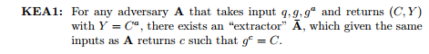
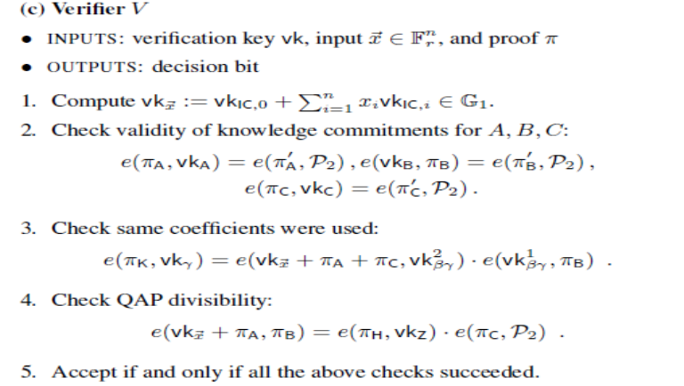

原文：[Zk-SNARKs: Under the Hood](https://medium.com/@VitalikButerin/zk-snarks-under-the-hood-b33151a013f6)

  <!--more-->

# Zk-SNARKS：由浅至深入门

在之前的文章中，我们介绍了二次运算程序 QAP ，这是一种用多项式方程表示任何计算问题的方法。我们还引入了椭圆曲线配对，它允许非常有限的单向同态加密形式，从而使我们可以进行相等性检查。现在，我们将从上次结束的地方开始，并使用椭圆曲线配对以及其他一些数学技巧，使得证明者能够证明他们知道特定 QAP 的解决方案，同时不会泄露任何有关实际解决方案的信息。

本文将重点介绍 2013 年 Parno，Gentry，Howell 和 Raykova 提出的皮诺曹协议（通常称为 PGHR13 ）;基本机制有一些变化，因此在实践中实施的 zk-SNARK 方案可能略有不同，但基本原则通常保持不变。

------

首先，让我们来了解一个关键的假设：指数知识假设(KEA)。这个假设我们将会在说明底层安全机制的时候会用到。

> KEA1：对于任何一个对手 A ，它接收输入 q,g, g^a ，然后返回 (C, Y) 并且 Y = C^a ，那么必然存在一个“提取者” A'，当它接收和 A 一样的输入时，能返回 c 使得 g^c = C 。

这个假设基本上意味着，如果你得到一对点 P 和 Q ，其中 P * k = Q ，并且你得到一个 C 点，那么除非 C 能以某种已知的方式从 P “导出”，否则不可能得出 C * k 对应的点。可能看起来这是明显的事情，但这个假设实际上不能从我们在证明椭圆曲线类的协议的安全性时通常使用的任何其他假设（例如，离散对数难题）得出，因此事实上 zk-SNARK 确实在某种程度上，它的某些安全性基础要弱于椭圆曲线密码学的基础 - 不过它仍然足够坚固，大多数密码学家都可以使用它。

------

现在，我们来看看如何使用它。假设我们凭空得到一对点（P，Q），其中 P * k = Q ，但没有人知道 k 的值是什么。现在，假设我想出了一对点（R，S），其中 R * k = S 。 然后，KoE 假设意味着我可以获得该对点的唯一方法就是通过 P 和 Q 乘以我自己所知的某个因子 r 。还要注意，由于椭圆曲线配对的非凡特性，要检查 R = k * S ，实际上并不需要知道 k  ——而是可以简单地检查 e（R，Q）= e（P，S）。

让我们做一些更有趣的事情。假设我们凭空得到十对点：（P_1，Q_1），（P_2，Q_2）......（P_10，Q_10）。在所有情况下，都满足 P_i * k = Q_i 。假设我然后给你一对点（R，S），其中R * k = S。你现在知道什么？你知道 R 是 P_1 * i_1 + P_2 * i_2 + ... + P_10 * i_10 的线性组合，其中我知道系数 i_1，i_2 ... i_10 。也就是说，获得这样一对点（R，S）的唯一方法是取一些 P_1，P_2 ...... P_10 的倍数并将它们加在一起，并对 Q_1，Q_2 ...... Q_10 进行相同的计算。

请注意，给定您可能想要检查线性组合的任何特定 P_1 ... P_10 点集，您实际上在不知道 k 值前是无法创建对应的 Q_1 ... Q_10 点，如果您确实知道 k 是什么，那么您可以创建一对（R，S），其中 R * k = S 表示您想要的任何 R ，而无需创建线性组合。因此，为了实现这一点，创建这些点的人必须都是值得信赖的，并且一旦创建了 10 个点，就要删除 k 。这就是“可信设置”概念的来源(译者注：可信设置，指的是 zkSNARK 系统启动的时候所进行一次设置，这个设置只需要进行一次)。

------

回忆一下，QAP 的解是一组多项式（A，B，C），使得 A（x）* B（x） -  C（x）= H（x）* Z（x），其中：

 A 是一组多项式 {A_1 ... A_m} 的线性组合
 B 是具有相同系数的 {B_1 ... B_m} 的线性组合
 C 是具有相同系数的 {C_1 ... C_m} 的线性组合
 集合 {A_1 ... A_m} ，{B_1 ... B_m} 和 {C_1 ... C_m} 以及多项式 Z 是问题陈述的一部分。

然而，在大多数现实世界中，A，B 和 C 都非常大；对于像散列函数那样具有数千个电路门的东西，多项式（以及线性组合的因子）可能有数千项。因此，我们不是让证明者直接提供线性组合，而是使用我们上面介绍的技巧来证明他们提供的东西是线性组合，并且无需透露任何其他东西。

您可能已经注意到上面的技巧适用于椭圆曲线点，而不是多项式。因此，实际的情况是，我们把下面的值添加到可信设置：

 G * A_1（t），G * A_1（t）* k_a
 G * A_2（t），G * A_2（t）* k_a
 ...
 G * B_1（t），G * B_1（t）* k_b
 G * B_2（t），G * B_2（t）* k_b
 ...
 G * C_1（t），G * C_1（t）* k_c
 G * C_2（t），G * C_2（t）* k_c
 ...
 您可以将 t 视为计算多项式的​​“秘密点”。 G 是一个“生成元”（椭圆曲线上面某个随机的点，一旦确定之后，就把它作为协议的一部分），t，k_a，k_b和k_c是“有毒废物”，这些数字必须不惜一切代价删除掉，否则任何拥有它们的人将能够制作假证明。现在，如果有人给你一对点 P，Q ，使得 P * k_a = Q（提醒：我们不需要 k_a 来检查这个，因为我们可以进行配对检查），那么你知道他们给你的是在t处计算出的A_i多项式的线性组合。

因此，到目前为止，证明者必须给出：

 π_a= G * A（t），π'_a= G * A（t）* k_a
 π_b= G * B（t），π'_b= G * B（t）* k_b
 π_c= G * C（t），π'_c= G * C（t）* k_c

注意，证明者实际上并不需要知道（并且不应该知道！）t，k_a，k_b或k_c来计算这些值；而是，证明者应该能够从我们添加到可信设置的点来计算这些值。

------

下一步是确保所有三个线性组合具有相同的系数。我们可以通过向可信设置添加另一组值来实现：$$G *$$（A_i（t）+ B_i（t）+ C_i（t））$$* b$$，其中 b 是应被视为“有毒废物”的另一个数字，一旦可信设置完成就丢弃。然后我们可以让证明者，使用相同的系数创建具有这些值的线性组合，并使用与上述相同的配对技巧，来验证该值与提供的 A + B + C 是否匹配。

最后，我们需要证明 A * B  -  C = H * Z 。我们再次进行配对检查：

e(*π_*a, *π_*b) / e(*π_*c, G) ?= e(*π_*h, G * Z(t))

其中 π_h= G * H（t）。如果你看不出此等式与 A * B  -  C = H * Z 之间的衔接关系，请返回并阅读有关配对的文章。

我们在上面看到了如何将 A，B 和 C 转换为椭圆曲线上的点；G 只是生成元（即，这个椭圆曲线点 G 相当于数字中的 1）。我们可以将 G * Z（t）添加到可信设置中。 H 更难计算；H 只是一个多项式，对于每个 QAP 的解来说，我们很难提前预测它的系数。因此，我们需要向可信设置添加更多数据;特别是序列：

G，G * t，G *t²，G *t³，G *t⁴......

在 Zcash 可信设置中，此处的序列大约为 200万;想想看你需要耗费多大的算力才能确保你能计算 H（t）。由此，证明者可以为验证者提供所有信息以进行最终检查。

------

还有一个我们需要讨论的细节。大多数时候，我们不仅仅想抽象地证明某些特定问题存在某种解决方案;相反，我们想要证明某些特定解决方案的正确性（例如，证明：如果把“cow”这个词用SHA3算法哈希一百万次，最终结果从0x73064fe5开始），或者如果限制一些参数就一定存在一个解。例如，在加密货币的实现中，交易金额和帐户余额已加密，您需要证明您知道某些解密密钥k，以便：

 decrypt（old_balance，k）≥deconspt（tx_value，k）
 decrypt（old_balance，k） -  decrypt（tx_value，k）= decrypt（new_balance，k）

加密后的old_balance，tx_value和new_balance需要公开出来，因为这些是我们在特定时间要查看的具体值;只有解密密钥需要被隐藏。需要对协议进行一些细微的修改才能创建一个“自定义验证密钥”，该密钥对应于对输入的某些特定限制。

------

现在，让我们退一步吧。首先，这里是完整的验证算法，由[Ben Sasson，Tromer，Virza和Chiesa](https://eprint.iacr.org/2013/879.pdf)提供：

第一行进行参数化处理; 实质上，您可以将其功能视为为指定某些参数的特定问题实例创建“自定义验证密钥”。第二行是A，B和C的线性组合检查;第三行是检查线性组合是否具有相同的系数，第四行是检查A * B  -  C = H * Z.

总而言之，验证过程是一些椭圆曲线乘法（每个“公共”输入变量一个）和五个配对检查，其中一个包括额外的配对乘法。提供的证明包含八个椭圆曲线点：A（t），B（t）和C（t）各一个点，b *（A（t）+ B（t）+ C（t）)的点π_k , 和H（t）的点π_h。其中7个点位于F_p曲线上（每个32个字节，因为您可以将y坐标压缩为1bit），在Zcash实现中，另一个点（π_b）位于F_p²（64字节）的扭曲曲线上，因此证明的总大小约为288字节。

创建证明的两个计算难度最大的部分是：

- 进行（A * B  -  C）/ Z得到H（基于快速傅立叶变换的算法可以在次二次时间内完成此操作，但它仍然计算量很大）
- 进行椭圆曲线乘法和加法以创建A（t），B（t），C（t）和H（t）的值及其对应的配对

创建证明很困难，它的原因是，因为我们要进行零知识证明，原始计算中的单个二进制逻辑门就必须变成通过椭圆曲线进行加密处理的操作。这一事实以及快速傅立叶变换的超线性，意味着Zcash交易中创建证明需要花费大约20-40秒。

------

另一个非常重要的问题是：我们可以尝试使可信设置稍微......对信任要求不高吗？不幸的是，我们无法让它完全无信任; KoE假设本身倒是排除了，在不知道k是什么的情况下形成独立对（P_i，P_i * k）的可能性。但是，我们可以通过使用N-of-N多方计算来大大提高安全性 - 也就是说，构建N方之间的可信设置，只要至少有一个参与者删除了他们的有毒废物然后你就可以了。

为了让你对如何做到这一点有一点感觉，这里有一个简单的算法，用于获取现有的集合（G，G * t，G *t²，G *t³......），并“加入”你自己的秘密，因此你需要你的秘密和以前的秘密（或以前的秘密的集合）才能作弊。

输出集很简单：

G，（G * t）* s，（G *t²）*s²，（G *t³）*s³......

请注意，除了现在使用t * s作为“有毒废物”而不是t之外，您可以仅知道原始集合和s， 以及与旧集合功能相同的新集合。只要您和创建前一集合的人（或人们），删除有毒废物没有都失败并且后来还串通了，那么该组就是“安全的”。

为完整的可信设置执行此操作要困难得多，因为涉及多个值，并且算法必须在多方之间经过若干轮才能完成。这是一个积极研究的领域，看看多方计算算法是否可以进一步简化，并且需要更少的轮次或更多的可并行化，因为如果能做到这些，就能让更多的参与方参与到可信的设置程序中。有理由看到为什么六个参与者之间的可信设置可能会让一些人感到不舒服，但是有数千名参与者的可信设置，几乎等同于去信任 —— 如果你真的是偏执狂，您可以自己进入并参与设置程序，并确保您个人删除了您的有毒废物。

另一个积极研究的领域是，不使用配对和这样可信设置，用其他方法来实现相同的目标。请参阅Eli ben Sasson最近的一个[演示文稿](https://www.youtube.com/watch?v=HJ9K_o-RRSY)（还是要提醒一下，它在数学上，至少与SNARKs一样复杂！）

特别感谢Ariel Gabizon和Christian Reitwiessner的审阅。