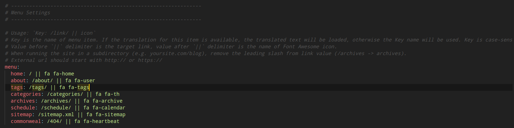

接下来我们来介绍一下基于 Next 主题的进阶优化

### 修改主题

首先我们先将 Hexo 默认的主题修改为 Next 主题：

* 安装 Next 主题

```
npm install hexo-theme-next
```

* 修改网站配置文件 ``_config.yml`` ，找到 theme 字段，修改为：

```
theme: next
```

  <!--more-->

* 修改**主题的配置文件**``_config.yml`` ，找到 Schemes 字段，选择自己喜欢的 Next 主题：

```
# Next主题可选样式
# Schemes
## Muse - 默认 Scheme，这是 NexT 最初的版本，黑白主调，大量留白
## Mist - Muse 的紧凑版本，整洁有序的单栏外观
## Pisces - 双栏 Scheme，小家碧玉似的清新
# scheme: MUSE
scheme: Mist
# scheme: Pisces
# scheme: Gemini
```

### 设置语言

* 修改**网站配置文件** ``_config.yml`` ，找到 language 字段，修改为：

```
language: zh-CN
```

### 初始化设置

* 配置文章默认格式，这样我们就有了一个 blog 的默认格式了		

修改``/scaffolds/post.md``：

```
---
title: {{ title }}
date: {{ date }}
top: false
cover: false
password:
toc: true
mathjax: true
summary:
tags:
categories:
---
```

### 设置头像

* 修改**主题的配置文件**``_config.yml`` ，找到 avatar 字段，修改 url 字段

### 设置菜单

菜单的设置同样是通过修改**主题的配置文件**``_config.yml`` ：

* 找到 ``menu`` 字段，如图：



我们可以看到菜单的配置是有三个部分组成的，第一项是菜单项，第二项是菜单的名称，最后一项是菜单所对应的图标。在 Next 中所调用的图标都是由 [Font Awesome](http://fontawesome.io/) 提供的。

NexT 默认的菜单项有（标注*的项表示需要手动创建这个页面）：

| 键值       | 设定值                    | 显示文本（简体中文） |
| :--------- | :------------------------ | :------------------- |
| home       | `home: /`                 | 主页                 |
| archives   | `archives: /archives`     | 归档页               |
| categories | `categories: /categories` | 分类页 *             |
| tags       | `tags: /tags`             | 标签页 *             |
| about      | `about: /about`           | 关于页面 *           |
| commonweal | `commonweal: /404.html`   | 公益 404 *           |

* 当然，我们也可以自己创建新的菜单选项，但是由于不是官方支持的菜单项，所以无法进行翻译，所以需要自己进行设置：

在 ``languages/zh-CN.yml`` 配置文件中找到 ``menu`` 字段，进行一个键值对的添加

### 设置侧边栏

侧边栏的设置包括两方面，一是侧边栏的位置，另一个是侧边栏出现的时机。都是通过修改**主题的配置文件**``_config.yml`` 来实现的，找到 ``sidebar`` 字段：

1. 通过修改 ``position`` 字段，可以将侧边栏置左或者置右

2. 通过修改 ``display`` 字段，可以设置侧边栏显示的时机：
   * `post` - 默认行为，在文章页面（拥有目录列表）时显示
   * `always` - 在所有页面中都显示
   * `hide` - 在所有页面中都隐藏（可以手动展开）
   * `remove` - 完全移除

### 增加文章阅读统计

#### 配置 LeanCloud 

我们要达到文章访问人数的统计就需要拿到相应的 AppID 以及 AppKey ，下面就是详细过程：

* **创建应用**
  * 在出现的界面点击`创建应用`
  * 新建 class，注意为了保证对 Next 主题的修改兼容，新建的 Class 名字必须为 `Counter`，对于所有权限的设置都选择 `所有用户`
  * 选择左侧的 `设置 -> 应用Keys` ，由此我们就获得了需要的 AppID 以及 AppKey
* 修改**主题的配置文件**``_config.yml`` ，找到 ``leancloud_visitors`` 字段，修改其中的 AppID 和 AppKey ，并将 `security` 字段改为 `false`

> 需要特别说明的是：记录文章访问量的唯一标识符是文章的`发布日期`以及`文章的标题`，因此请确保这两个数值组合的唯一性，如果你更改了这两个数值，会造成文章阅读数值的清零重计。

### 开启图片预览

* 下载插件

```
git clone https://github.com/theme-next/theme-next-fancybox3 fancybox
```

* 移动到 Next 主题下，我的路径为 ``node_modules/hexo-theme-next/source/lib/``
* 修改**主题的配置文件**``_config.yml`` ，找到 ``fancybox`` 字段，修改为 ``true``

### 利用不蒜子在底部增加访客计数

* 修改**主题的配置文件**``_config.yml`` ，找到 ``busuanzi_count`` 字段，修改为 ``true``
* 将其中 `post_views` 字段改为 `false`

