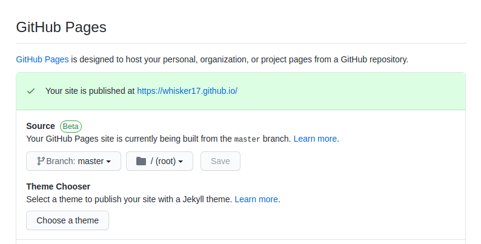

本篇博客是记录本人在搭建该博客时的操作。

## Pre-build

- 在 github 上新建一个 repo ，命名为 xxxx.github.io ，但是具体的域名要在 Settings 中寻找

- 在 repo 的 Settings 中选择 github pages 的主题，这里还可以看到具体的 url 地址

  

  <!--more-->

- 安装 Hexo

  ```
  npm i hexo-cli -g
  ```

- 安装扩展

  ```
  npm i hexo-deployer-git
  ```

------

## Building

- **将本地的博客项目与 github 连接起来**，打开博客根目录下生成的 `_config.yml` 文件，这是博客的配置文件，可以修改博客的相关配置。

  现在我们修改最后一行的配置：

  ```
  deploy:
    type: git
    repository: git@github.com:xxxxxx/xxxxxxx.github.io.git
    branch: master
  ```

  这里设置为 ssh 的连接方式，方便后续的 deploy ，如果使用 https 方式，则每次 deploy 都需要输入 github 用户名和密码。

- **写文章与发布文章**，然后输入`hexo new post “xxxxx”`，这样就新建了一篇文章。

  此时，在`source/_posts`目录下会生成一个 md 文件，这样你就可以开始编写博客了。

  完成后，在根目录输入`hexo g`生成静态网页，然后输入`hexo s`就可以本地预览效果，你可以通过`localhost:4000`查看效果

  最后，你可以通过`hexo d`将博客盛传到 github 上，此时你就可以通过 Settings 中的 url 地址进行访问

  

------

## Tips

* 注意新建的 repo 中的 xxxx.github.io 最好和用户名相同，否则会出现 hexo 不起作用的效果