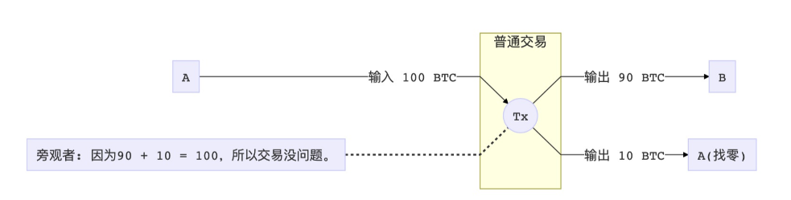
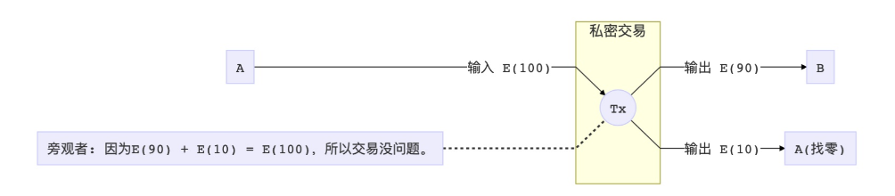
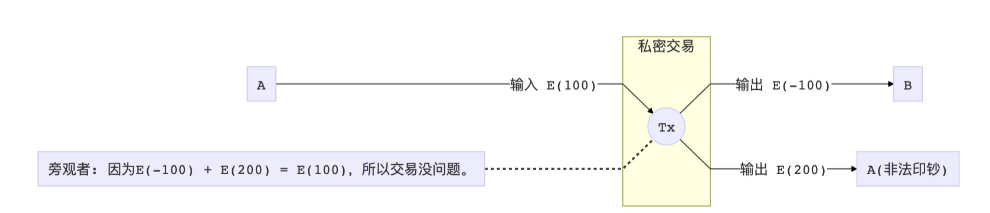

**承诺方案（commit scheme）**主要目的是提供**“针对双方的信息互换方案”**，通过隐藏关键值来避免信息泄露。Pedersen Commitment也不例外，但不同于普通的承诺方案，其可以通过**不揭露相关信息来达到确认双方是否拥有某一个相同的值。**承诺方案有两个基本性质：**隐藏性（Hiding）**和**绑定性（Binding）**。隐藏性为承诺值不会泄露任何关于消息 m 的信息；绑定性是指任何恶意的承诺方都不能将承诺打开为非 m 的消息且验证通过，即接收方可以确信 m 是和该承诺对应的消息。

  <!--more-->

## Pedersen Commitment 原理解析

Pedersen Commitment 是密码学中承诺方案的一种，于1992年被 Torben Pryds Pedersen 在 “Non-Interactive and Information-Theoretic Secure Verifiable Secret Sharing” 一文中提出。目前 Pedersen Commitment 主要搭配椭圆曲线密码学使用，其核心可以用一项公式表达：

$$C=r*G+v*H$$

其中， C 为承诺值，G、H 为托顶椭圆曲线上的两个生成元，r 代表盲因子，v 代表原始信息。由于 G、H 为椭圆曲线上的两个生成元，所以 $$r*G\ 和\ v*H$$ 均为相应的曲线上的公钥，根据椭圆曲线的离散对数难的问题，我们几乎无法解出私钥，即 r、v 。

在 Pedersen Commitment 里面，发送和接收方是知道明文（转账的金额）的。 Pedersen Commitment 是要保证参与双方知道（才能生成正确的承诺），但是其他人不知道的情况下，能验证明文（转账的金额）是承诺的明文。下面介绍一下具体的原理：

假设 Alice 给 Bob 转账金额 n ，Alice 生成自己的承诺：$$C_{Alice}=n*G+r_{Alice}*H$$ ，其中 $$r_{Alice}$$ 为 Alice 选择的盲化因子。 而 Bob 类似生成如下的承诺： $$C_{Bob}=n*G+r_{Bob}*H$$ ，双方公布自己的承诺，然后双方分别相减：

$$C_{Alice}-C_{Bob}=n*G+r_{Alice}*H-n*G-r_{Bob}*H=(r_{Alice}-r_{Bob})*H$$ ，然后双方都公布这个差值，如果完全相同，那么就可以保证 n 是相等的。

## 范围证明

如果 A 有 100 个币的余额，付 90 个币给B，那么这笔交易大概长这样：

由于 ECC 的加法同态，如果我们有一个加法同态的加密方法 E ，我们就可以把这笔交易转化成：

显而易见，此时我们会有一个巨大的漏洞，虽然 Pederson Commitment 证明了数字之间的关系，但是并没有限制任何数字的取值区间。那也就说，A 就可以使坏，提交一笔交易，说自己要付 -100 个币给 B ，然后“找”给自己 200 个币，这样一来一去，等式还是成立的。 A 就可以借此无限印钞，从而摧毁整个系统。

解决方案的话，我们在这里就不详述了，大致就是引入一个范围证明的电路，在之后的文章里会具体介绍。

## Pedersen Commitment 应用

先说结论，考虑到应用难度，UTXO 结构相比账户结构更适合以 Pedersen Commitment 来实施匿名方案。