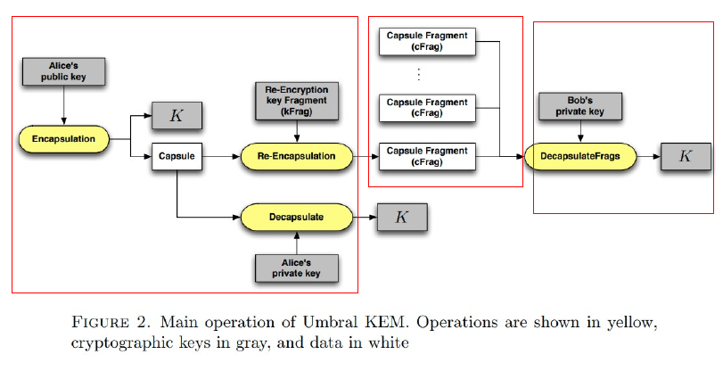
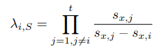
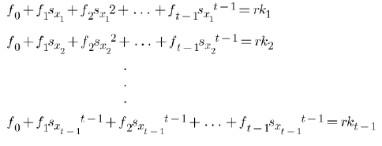
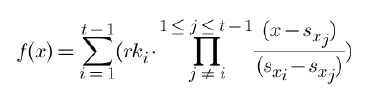
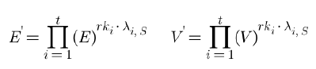
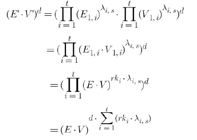
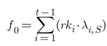
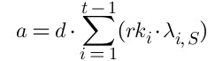

随着云计算的发展，我们越来越趋向于将数据保存在第三方云端上，同时这些数据的安全性也越来越收到用户的重视。在传统的加密技术中，用户的数据被加密之后存储到云端，当用户需要这些数据时，从云端获取加密的数据，然后使用自己的私钥对这些加密的数据进行解密从而获得明文信息。

  <!--more-->

## 代理重加密

首先我们需要了解，如果我们要做一次点对点的分享，用户 Alice 想把自己的一份原文发送给 Bob ，当然不可能直接把原文发送过去，这样容易造成数据的泄露，那么我们可以通过加密的手段使得他人拦截到的数据无法被破译，最简单的方式就是 Alice 自己生成一对公私钥对，然后用自己的公钥对原文进行加密，然后将私钥交给 Bob ，使得 Bob 可以通过该私钥对密文进行解密从而获得原文。But, hold on ~~ 如果 Alice 和 Bob 之间可以相互安全的传送私钥，那还有什么必要去进行加密这一步呢？私钥如果被拦截，任何人都可以反解出原文是什么了，如果双方可以安全的传输私钥而不被其他人拦截，那何不直接传输原文呢？

于是就衍生出了另一种方案，需要双方**各自生成一对公私钥对**，然后就是这样一个过程：

1. Alice 使用 Bob 的公钥对需要分享的信息进行加密
2. 将密文发送给 Bob
3. Bob 接收到密文，用自己的私钥进行解密从而获得原文

由此我们可以了解到这种方案的缺陷，如果我们需要将这段信息分发给多个用户，那 Alice 本人就需要用所有用户提供的公钥对自己的原文进行加密后再分发，这无疑大大增加了发送方的负担，让发送方体验非常糟糕。那么，我们是否可以借助一个代理方，将这个过程释放到一个性能更高的代理方，但是有可以保证自己的原文不被泄露呢，于是就引出了**代理重加密**这个概念。

> 代理重加密是一种公钥加密方案，允许用户 Alice 将她的解密权限“委托”给另一个用户 Bob 。Alice 可以委托一个半可信代理将一个被自己所加密的密文转化为一个相当于被 Bob 所加密的密文。
>
> 同时，半可信代理是独立于 Alice 运行的，这也解决了增加 Alice 负担的问题。当然，我们也需要保证代理是无法看到 Alice 的原文的，也不能将 Alice 的消息重新加密给 Alice 没有授予解密权限的用户。

假设有这样一个场景，Alice 有事儿要出门，希望让 Bob 来处理自己不在家这段时间收到的邮件，但是又不希望把自己邮箱的密码告诉 Bob ，所以希望将自己这段时间邮箱里收到的邮件都转发给 Bob ，但是害怕邮箱的管理人员会看到自己的邮件，所以将邮件加密后指定 Bob 作为接收人，让 Bob 可以通过自己的私钥去解密这些邮件。但是这样的需求要如何做到呢，由于邮件的密文形式是由 Alice 的公钥进行加密的，即使直接转发给了 Bob ，他也无法进行解密，最简单的方法就是将 Alice 的私钥发送给邮件服务器，邮件服务器对密文进行解密然后再通过 Bob 的公钥对明文加密，这样转发给 Bob 的密文就可以通过 Bob 的私钥进行解密了。但是与此同时邮件服务器这端就获取了 Alice 的明文信息，这也是 Alice 无法接受的。

那么，到底该如何做到呢？


## Umbral

这里具体介绍一种方案的原理。下图的三个框表明了这些操作各自分属于 Alice ，Proxy ，Bob 。



首先我们明确一下在 Umbral 中的各个操作的意义。

### KeyGen && ReKeyGen

* **KeyGen()：** 生成一组公私钥对
* **ReKeyGen($$sk_A,pk_B$$,N,t)：** 通过 Alice（授权人） 的私钥以及 Bob（被授权人） 的公钥，以及分片的数量 N 和门限值 t，生成一组 kfrag 

### Encapsulation && Decapsulation

* **Encapsulation($$pk_A$$)：** 可以根据公钥 pka 生成一个对称密钥 K 以及一个特殊的结构 capsule
* **Decapsulation($$sk_A$$,capsule)：** 可以根据一个私钥和一个 capsule 反推出相应的对称密钥 K


### Re-Encapsulation && Fragments Decapsulation

* **ReEncapsulation(kFrag, capsule)：** 通过输入一个生成的 kfrag 结构以及 capsule ，生成一个 capsule 的 frag 结构，即 cfrag 
* **DecapsulateFrags($$sk_B,(cFrags)^t_{i=1},$$ capsule)：** 通过 Bob 的私钥和收到的 capsule ，对一组 cfrag 反推出对密文加密的对称公钥 K 


接下来，我们来剖析一下在这些操作中具体做了些什么：

首先，我们先定义了 $$g,U\ \in \ \mathbb{G}$$ ，$$\mathbb{G}$$ 指的是一个循环群，g 和 U 都是作为公私钥转化时的底数。

* **ReKeyGen($$sk_A$$ , $$pk_B$$ , N,t)：**

  1. 取一个随机数 $$ x^A \ \in \ \mathbb{Z}_q$$ ，计算出以此为私钥所得的公钥 $$X^A=g^{x^A}$$ 
  2. 将 $$x_A$$ ，$$pk_$B$ ，$$(pk_B)^{x^A}$$ 级联并求得其 Hash 值，即求得 $$d=H( X_A ，pk_B ，(pk_B)^{x^A})$$ ，d 即为这对临时密钥对  ($$x^A$$ , $$X^A$$) 和 Bob 这端公私钥对之间一个非交互式的 DH 密钥交互的结果，我们借助 d 来使得两端的重加密密钥生成过程变成非交互式。
  3. 取 t-1 个随机数 $$f_i \ \in \ \mathbb{Z}_q$$，同时计算 $$f_0=sk_A*d^{-1} \  mod \ q$$ 
  4. 构造这样一个 t-1 阶的多项式 $$f(x)=f_0+f_1x+f_2x^2+\ ...\ +f_{t-1}x^{t-1}$$
  5. 计算 $$D=H(pk_A ，pk_b ，(pk_B)^{sk_A})$$
  6. 取两个随机数 $$y,id\ \in \mathbb{Z}_q$$ ，计算 $$s_x=H(id,D)，Y=g^y$$ ，将 $$s_x$$ 代入多项式，求得 $$rk=f(s_x)$$ ，将 rk 代入，求得 $$U_1=U^{rk}$$ 。
  7. 将上述值代入，求得 $$z_1=H(Y,id,pk_A,pk_B,U_1,X_A)，z_2=y-a*z_1$$ 
  8. 定义 kFrag 的结构为一个这样的元组 $$(id,rk,X_A,U_1,z_1,z_2)$$
  9. 将 6-8 重复 N 次，由此获得一个大小为 N 的元组数组 kFrags

* **Encapsulation($$pk_A$$)：**

  1. 取两个随机数 $$r,u\ \in \mathbb{Z}_q$$ ，计算 $$E=g^r，V=g^u$$ 
  2. 根据 E 和 V ，我们求得 $$s=u+r*H(E,V)，K=KDF((pk_A)^{r+u})$$ ，KDF 是一个生成密钥的函数，可以类似的认为是一个随机预言机
  3. 由此，我们定义 capsule 这个结构为一个这样的元组 $$(E,V,s)$$ ，同时我们也得到了一个用于加密的对称密钥 K  

* **CheckCapsule(capsule)：**

  如果我们需要验证 capsule 是否正确，可以通过计算 $$g^s=V*E^{H(E,V)}$$ 两端是否相等来判断，该公式的推导过程如下：
  $$
  g^s=g^{u+r*H(E,V)}=V*E^{H(E,V)}
  $$

* **Decapsulate($$sk_A$$, capsule)：**

  既然我们可以通过公钥去打包一份 capsule 并由此生成一个对称密钥来对明文加密，那么我们一定也就可以通过对应的私钥和 capsule 来重新生成这个我们所需要的对称密钥 K 。即 $$K=KDF((E*V)^{sk_A})$$ ，下面是推导过程：
  $$
  K=KDF((E*V)^{sk_A})\\=KDF(g^{r*sk_A+u*sk_A})\\=KDF(g^{sk_A*(r+u)})\\=KDF((pk_A)^{r+u})
  $$
  在计算前我们会先进行对 CheckCapsule 这个函数的调用，以确保 capsule 的有效性。

* **ReEncapsulation(kFrag, capsule)：**

  已知会输入 kFrag 和 capsule 这两个元组，其结构为 $$kFrag=(id,rk,X_A,U_1,z_1,z_2)，capsule=(E,V,s)$$ ，首先我们会先调用 CheckCapsule 这个函数，以确保 capsule 的有效性。然后我们计算 $$E_1=E^{rk}，V_1=V^{rk}$$ ，随即得出一个新的元组 $$cFrag=(E_1,V_1,id,X_A)$$

* **DecapsulateFrags($$sk_B, (cFrags)^t_{i=1},$$ capsule)：**

  我们会在 Bob 端收到多个 cFrag ，只要达到门限值，我们就可以进行反推。现在我们需要通过上述的输入来推出用于加密明文的对称密钥 K ：

  1. 计算 $$D=H(pk_A,pk_B,pk_A^{sk_B})$$
  2. 计算 $$s_{x,i}=H(id_i,D)$$ 并由此组成大小为 t 的数组 S 
  3. 计算 
  4. 计算$$E^{'}=\prod_{i=1}^t{({E_{1,i}})^{\lambda_{i,S}}}，V^{'}=\prod_{i=1}^t{({V_{1,i}})^{\lambda_{i,S}}} $$ 
  5. 计算 $$d=H(X_A,pk_B,X_A^{sk_B})$$ 
  6. 最后计算对称密钥 $$K=KDF((E^{'}*V^{'})^d)$$

  ？？？发生了什么，为什么突然就算出了对称密钥 K ，下面我们就来仔细分析一下 Alice 和 Bob 两端所计算的值

  * 在 Alice 端，我们计算了$$D=H(pk_A ，pk_b ，(pk_b)^{sk_A})$$ ，而在 Bob 端，我们同样计算了 $$D=H(pk_A,pk_B,pk_A^{sk_B})$$ ，由于
    $$
    pb_B^{sk_A}=g^{b*a}=g^{a*b}=pk_A^{sk_B}
    $$
    于是，我们可以推出两端的 D 是相等的

  * 在 Alice 端，我们计算了$$d=H( X_A ，pk_B ，(pk_B)^{x^A})$$ ，而在 Bob 端，我们同样计算了 $$d=H(X_A,pk_B,X_A^{sk_B})$$ ，由于
    $$
    (pk_B)^{x^A})=g^{sk_B*x^A}=X_A^{sk_B}
    $$
    于是，我们可以推出两端的 d 是相等的
  
  * 在 Alice 端，我们构建了一个多项式组 $$rk_i=f(s_{x_i})$$：
  
    
  
    根据拉格朗日插值法，我们可以得出该多项式的解，有兴趣的同学可以看我写的另一篇文章 [《插值法综述》](https://whisker17.github.io/2020/08/18/Interpolation/#more) 。该多项式的解为：
  
    
  
    而在 Bob 端，我们通过计算 $$E^{'}\ 和\ V^{'}$$ 来反推密钥，那么 $$E^{'}\ 和\ V^{'}$$ 到底是什么呢，我们来计算一下：
  
    已知 $$E_1=E^{rk}，那么\ E_{1,i}=E^{rk_i}$$ ，于是我们可推：
  
    
  
    那么
  
    
  
    根据多项式组的解以及 $$\lambda_{i,S}$$ ，我们可以得出：
  
     
  
    又因为在 Alice 端我们知道 $$f_0=sk_A*d^{-1} \  mod \ q$$ ，而在 Bob 端的 $$f_0$$ 如上，那么：
    $$
    K_{Alice}=KDF((E*V)^{sk_A})=KDF((E^{'}*V^{'})^d)=K_{Bob}
    $$
    得证。

这里又出现了一个新的问题：Bob 是否可以算出 Alice 的私钥？

因为我们可以看到 ，那么我们好像就可以算出 Alice 的私钥了，这里我们可以知道，在 Bob 端我们是已知 $$d \ 和\ \lambda_{i,S}$$ 的，但是我们是不知道 $$rk_i$$ 的，但是 Proxy 是知道这个参数的，这就引出了这个方案的一个前提要求，即：**要求 Proxy 是一个半可信的机构**

## PyUmbral

下面介绍一下具体的操作，即PyUmbral，之前提到的 Umbral 的 Python 实现版本。

### Key Generation

* 在 Alice 端生成两组非对称加密的公私钥对
* 在 Bob 端生成一组非对称加密的公私钥对

```python
from umbral import pre, keys, signing

# Generate Umbral keys for Alice.
alices_private_key = keys.UmbralPrivateKey.gen_key()
alices_public_key = alices_private_key.get_pubkey()

alices_signing_key = keys.UmbralPrivateKey.gen_key()
alices_verifying_key = alices_signing_key.get_pubkey()
alices_signer = signing.Signer(private_key=alices_signing_key)

# Generate Umbral keys for Bob.
bobs_private_key = keys.UmbralPrivateKey.gen_key()
bobs_public_key = bobs_private_key.get_pubkey()
```


### Encryption

* 通过 Alice 的公钥对明文进行加密，从而获得密文和 capsule
* 相应的，我们也可以通过 Alice 的私钥对密文以及 capsule 进行解密，从而获得明文

```python
# Encrypt data with Alice's public key.
plaintext = b'Proxy Re-Encryption is cool!'
ciphertext, capsule = pre.encrypt(alices_public_key, plaintext)

# Decrypt data with Alice's private key.
cleartext = pre.decrypt(ciphertext=ciphertext,
                        capsule=capsule,
                        decrypting_key=alices_private_key)
```


### Re-Encryption Key Fragments

* Alice 可以使用自己的私钥生成 kfrags

```python
# Alice generates "M of N" re-encryption key fragments (or "KFrags") for Bob.
# In this example, 10 out of 20.
kfrags = pre.generate_kfrags(delegating_privkey=alices_private_key,
                             signer=alices_signer,
                             receiving_pubkey=bobs_public_key,
                             threshold=10,
                             N=20)
```


### Re-Encryption

* Bob 端通过 Alice 的公钥以及验证公钥和自己的公钥完整 capsule，并且通过接收到一定数量的 kfrag 得到相应的 cfrag

```python
# Several Ursulas perform re-encryption, and Bob collects the resulting `cfrags`.
# He must gather at least `threshold` `cfrags` in order to activate the capsule.

capsule.set_correctness_keys(delegating=alices_public_key,
                             receiving=bobs_public_key,
                             verifying=alices_verifying_key)

cfrags = list()           # Bob's cfrag collection
for kfrag in kfrags[:10]:
  cfrag = pre.reencrypt(kfrag=kfrag, capsule=capsule)
  cfrags.append(cfrag)    # Bob collects a cfrag
```


### Decryption by Bob

* 最终 Bob 可以通过 cfrags 以及自己的私钥对接收到的密文进行解密

```python
# Bob activates and opens the capsule
for cfrag in cfrags:
  capsule.attach_cfrag(cfrag)

bob_cleartext = pre.decrypt(ciphertext=ciphertext,
                            capsule=capsule,
                            decrypting_key=bobs_private_key)
assert bob_cleartext == plaintext
```


## 总结

综上所述，我们来总结一下 PRE 与传统 PKE 的对比。

在静态场景下，传统做法有一个较长的初始化过程。在实际运用中，重加密方法需要较大的计算需求，但节约了一部分存储，两种方式差距不是特别明显。

但一般情况下，文件系统的用户和内容都是动态的，此时重加密做法的优势明显。具体来说，在增加用户时，传统做法需要本地对已有的所有加密密钥进行加密，可能花费很长时间。在增加文件时，重加密做法下，数据分享者只需要使用自己的公钥去加密对称密钥即可，而传统做法需要做M次非对称加密。更新文件加密密钥时，重加密做法的数据分析者只需要使用自己的公钥去加密对称密钥即可（无需再次生成重加密密钥），而传统做法需则需要重新执行初始化过程。另外，服务端拥有更强的计算能力，重加密算法把这些计算过程让服务端更多承担，尽量减少客户端的计算，符合架构设计原理。最后，重加密算法的弹性更好，一般来说，x不会是一个太大的数，当文件访问稀疏时，在一开始就执行多次可能无用的加密是巨大的浪费。

总的来说：

1. 对于同一类明文，我们使用的相同的对称密钥进行加密，与对端的用户无关
2. 对于对端不同的用户，我们需要在本端针对不同的用户生成不同的重加密密钥，与本段文件无关
3. 在做完授权的部分后，本端将不再参与其他过程，解放客户端的压力，使之成为一个非交互性的系统


## Reference

1. [Improved Proxy Re-Encryption Schemes with Applications to Secure Distributed Storage](https://spqrlab1.github.io/papers/ateniese-proxy-reenc-ndss05.pdf)
2. [代理重加密若干问题研究](https://www.doc88.com/p-2703873549583.html)
3. [UMBRAL: A THRESHOLD PROXY RE-ENCRYPTION SCHEME](https://github.com/nucypher/umbral-doc/blob/master/umbral-doc.pdf)
4. [NuCypher KMS: Decentralized key management system](https://arxiv.org/pdf/1707.06140.pdf)
5. [PyUmbral](https://github.com/nucypher/pyUmbral/)