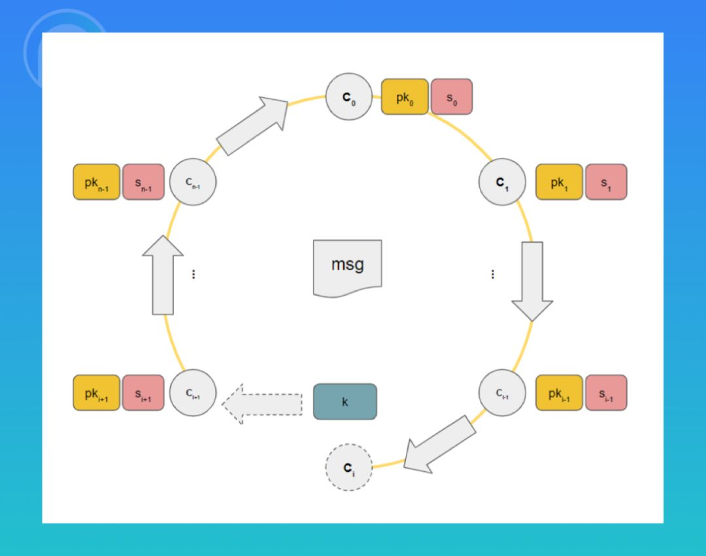
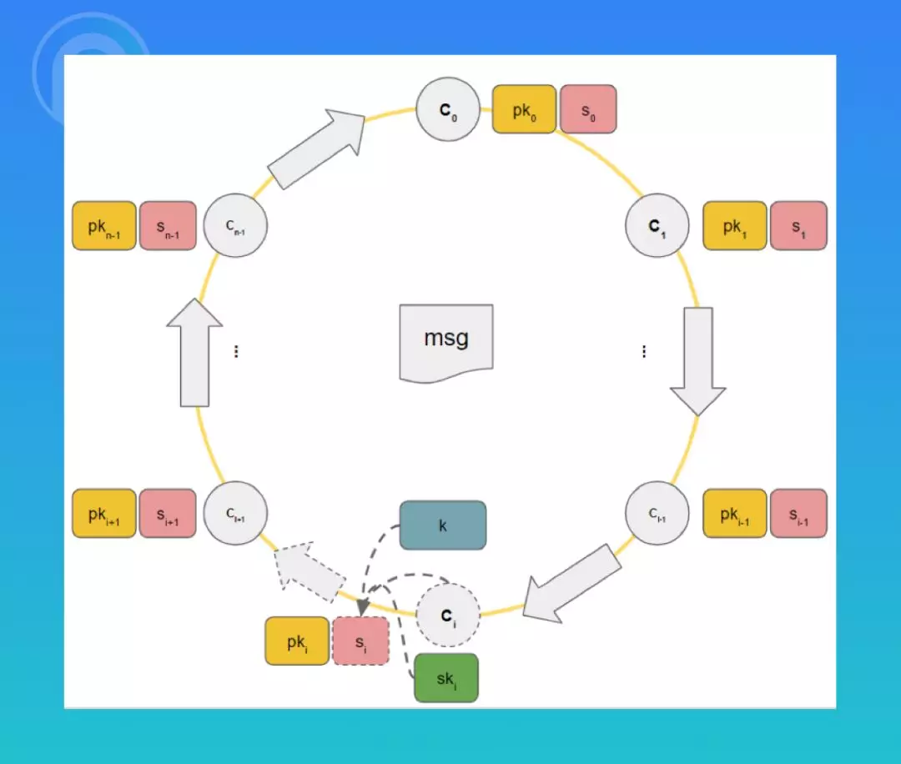
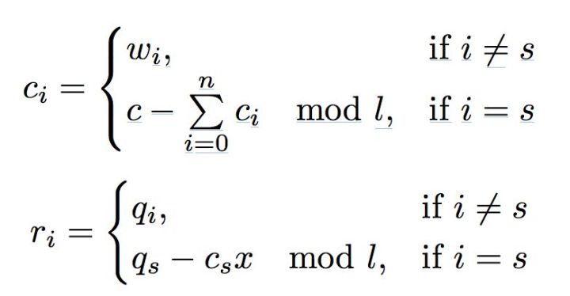
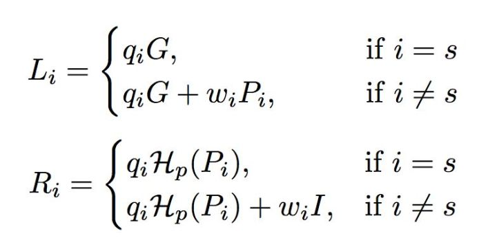
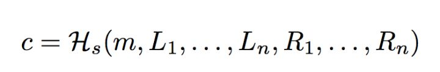
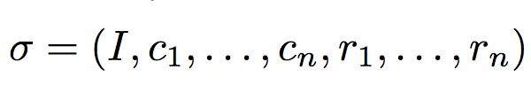
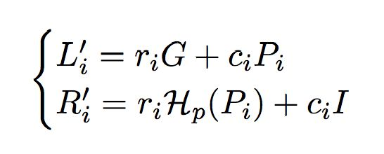
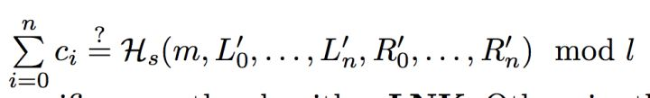

隐私是用户最关心的问题之一，而环签名解决的问题是，我对你说了一句话，但是你只知道是某一群人中有人对你说了这句话，而不知道这群人里具体哪个人说的。简言之就是，我把自己藏进了人群里。环签名通过将实际签名者的公钥藏进一个公钥集合，来达到保护签名者身份的目的。例如，某协会主席提出一种议案，但如果协会成员中有人提出反对意见则议案需被取消。但投反对票的会员又不想暴露自己的身份，因此他可以用环签名的技术，将自己的反对票用自己的私钥和其他协会成员的公钥进行签名。签名之后所有协会成员都可以看到协会中有人反对该项议案，但不知道确切的反对者是谁。

  <!--more-->

环签名也被称为 CryptoNote，由**群签名**演化而来，典型的应用案例是门罗币。群签名是利用**公开的群公钥和群签名**进行验证的方案，其中群公钥是公开的，群成员可以生成群签名，验证者能利用群公钥验证所得群签名的正确性，但不能确定群中的正式签名者。**可是群管理员可以撤销签名**，揭露真正的签名者群签名，这是群签名的关键问题所在。

**环签名方案则去掉了群组管理员**，不需要环成员之间的合作，**签名者利用自己的私钥和集合中其他成员的公钥就能独立的进行签名**，集合中的其他成员可能不知道自己被包含在了其中。这种方案的优势除了能够对签名者进行无条件的匿名外，环中的其他成员也不能伪造真实签名者签名。外部攻击者即使在获得某个有效环签名的基础上，也不能伪造一个签名。

那么环签名是如何做到这点的呢？接下来我们用椭圆曲线来举例说明环签名的具体技术关键点和原理。

## 环签名的生成过程

假设我们的签名者拥有一对公私钥对 (sk,pk) ，由于我们采用的是 ECC 加密算法，所以 $$pk=sk*G$$ ，G 为椭圆曲线上的基点，也被称为生成元。这里的 “*” 是倍乘，即 sk 个 G 点在椭圆曲线上进行加法运算。

以上是前提准备，接下来我们来介绍一下具体的步骤：

1. 签名方找来 n-1 个其他人的公钥，并编好序号，然后将自己的公钥随机插入其中，组成一个包含 n 个公钥的集合，即 $$pk_0,pk_1,pk_2,\ ...\ ,pk_{i-1},pk_i,pk_{i+1},\ ...\ ,pk_{n-1}$$ ，其中 $$pk_i$$ 为签名方的公钥。

2. 签名方随机生成 n-1 个随机数 $$s_0,s_1,s_2,\ ...\ ,s_{i-1},s_{i+1},\ ...\ ,s_{n-1}$$ ，分别与除了 $$pk_i$$ 以外的 n-1 个公钥一一对应，而 $$s_i$$ 会在后面的计算中求出。

3. 签名方随机生成 k ，并计算 $$k*G$$  ，这里我们假设 $$k*G=s_i*G+c_i*pk_i$$ ，具体的意义我们可以先不用了解，但是我们知道如果我们可以得到 $$pk_i\ 的私钥\ sk_i\ 且知道\ c_i\ 和\ k$$ ，根据 $$pk=sk*G$$ ，我们代入原式，就可以求出 $$s_i$$ 。

4. 接下来引入第二个式子： $$c_x=Hash(m,s_{x-1}*G+c_{x-1}*pk_{x-1})$$ 。我们可以看出来，这是一个递推的式子，而且我们注意到 Hash 函数的右半部分和过程 3 中的式子是一致的。连立两个等式，我们可以求得： $$c_{i+1}=Hash(m,s_i*G+c_i*pk_i)=Hash(m,k*G)$$ 。以此计算：
   $$
   c_{i+2}=Hash(m,s_{i+1}*G+c_{i+1}*pk_{i+1})\\
   ...\\
   c_{n-1}=Hash(m,s_{n-2}*G+c_{n-2}*pk_{n-2})\\
   c_{0}=Hash(m,s_{n-1}*G+c_{n-1}*pk_{n-1})\\
   c_{1}=Hash(m,s_{0}*G+c_{0}*pk_{0})\\
   ...\\
   c_{i}=Hash(m,s_{i-1}*G+c_{i-1}*pk_{i-1})\\
   $$
   

   

5. 有了 $$c_i$$ 之后，代入步骤 3 的等式中，即 $$k*G=s_i*G+c_i*sk_i*G$$ ，推出 $$k=s_i+c_i*sk_i$$ ，由此我们也可以推出 $$s_i$$ 了 

6. $$s_i$$ 一旦求出，环签名的环就形成了，此时我们就可以消去 k ，即：

$$
c_0=Hash(m,s_{n-1}*G+c_{n-1}*pk_{n-1})\\
c_1=Hash(m,s_{0}*G+c_{0}*pk_{0})\\
...\\
c_{n-1}=Hash(m,s_{n-2}*G+c_{n-2}*pk_{n-2})\\
$$

7. 最后明文 m 的环签名数据为：

$$Signature={c_0,pk_0,\ ...\ ,pk_{n-1},s_0,\ ...\ ,s_{n-1}}$$

## 环签名的验证过程

验证着根据 $$c_0,pk_0,\ ...\ ,pk_{n-1},s_0,\ ...\ ,s_{n-1}$$ ，明文 m 和步骤 4 的等式依次求出 $$c_1,c_2,\ ...\ ,c_{n-1}$$ ，最后根据 $$c_{n-1}\ 求出\ c^{'}_0$$ ，对比$$c_0\ 和\ c^{'}_0$$ 是否相等，如果相等则签名有效，否则无效。

## CryptoNote

现在我们来结合实际，在现实中， Monero 的底层就使用了环签名的概念，即 CryptoNode 。

首先我们引入 **Stealth Address** 的概念。

1. Bob 需要选取两个数 a 和 b 作为私钥，并在 ECC 椭圆曲线上计算出对应的公钥 A 和 B 。A=aG, B=bG，G是曲线上一个公用的基点。然后 Bob 将计算出来的这两个公钥 A、B 向全网公布。
2. 现在 Alice 想向给 Bob 发起一笔交易，需要先获取到 Bob 公布的公钥 A、B ，然后选取一个随机整数 r 作为另一个私钥，通过公式 P=Hs(rA)G+B ，计算出公开地址 P 。
3. Alice 再通过公式 R=rG ，将随机整数 r 转换成 R 。
4. Alice 创建转账交易，并将计算出的 R、P 一起记录到交易中公布到区块链上。由于使用了哈希函数，所以根据 R、P 是无法推断出 A、B ，从而无法获悉接收人是 Bob。
5. Bob 扫描区块链上的交易，根据公式 P'=Hs(aR)G+bG 计算 P'，如果交易的接收人是 Bob ，根据 aR = arG = rA ，所以 P'= Hs(aR)G+B = Hs(rA)G+B = P ，也就是检测到 P'=P 时，就可以认为这笔交易是发给 Bob 的。
6. Bob根据公式 x=Hs(aR)+b ，计算得到一个整数，因为有 xG = Hs(aR)G+bG = Hs(aR)G+B = P , 符合 ECC 算法定义，x 就是针对公钥 P 的私钥，而这个私钥连给钱的 Alice 也无法推算出。日后 Bob 就可以使用这个私钥来花费这笔钱了。

### CryptoNote 方案

1. 生成随机数q，w
2. 对q，w进行转换

3. 零交互转换

4. 得到 challenge 和 response

.jpg)

5. 最终签名

6. 根据 signature 保存的及其他数据，运用算法计算出 L，R

7. 效验签名是否正确

综上所述
签名就是：随机数 + 要签名的数据，已有的数据 + 算法 ---> 签名结果
效验就是：签名结果 + 要签名的数据，已有的数据 + 算法 ---> 效验结果

## 总结

回顾一下签名的整个过程，关键的巧妙点在于，如果知道私钥 $$sk_i$$ ，那么就可以反推出 $$s_i$$ ，使 $$c_1,c_2,\ ...\ ,c_{n-1}$$ 形成一个环。就好像签名者找了一根铁丝，数学保证了只有拥有私钥的人，才能把铁丝的两头接起来，形成铁丝环。而且一旦成为铁丝环之后，环的接点处也没有任何痕迹，这使得验证者无法判断铁环是在哪个位置上接起来的。

环签名虽然可以用来做到一定程度的匿名性，不过毕竟真实的签名者还是会暴露在环中。且在目前的公有链市场上，与环签名相比，零知识证明依然是最佳的匿名方案之一。只是在某些场景下，如果对隐私的要求没有那么高，同时签名方的计算能力又很弱，环签名不失为一个不错的选择。