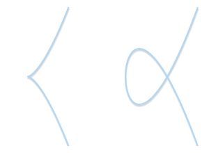
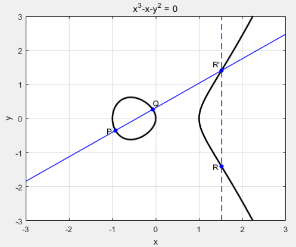

为什么在现阶段众多的区块链项目的选择依旧是 ECC 而不是 RSA 呢？这两种加密算法又有什么区别和各自的优缺点呢？

  <!--more-->

RSA 加密算法是一种非对称加密算法，什么是非对称加密算法呢？简单来说就是加密和解密不是互为逆过程，下面先给大家普及一下**对称加密算法和非对称加密算法的区别**：

如果有这样一个场景， Alice 和 Bob 有想要共享的明文，两者要如何传递这个信息而不用担心被第三方窃听到呢？对于**对称加密**而言，只需要 Alice 和 Bob 双方共同拥有一个密钥， Alice 这边用这个密钥对明文进行加密，然后发送给 Bob 。所有第三方由于没有这个密钥，是无法破解这串密文的，但是到了 Bob 这端， Bob 可以用密钥进行解密，从而得到明文，这样加密和解密是不是就是一个逆过程了。但是，这样的方案有严重的缺陷，实际情况中我们无法让 Alice 和 Bob 提前商量好使用同一个密钥而不被第三方窃听到，如果能做到这样的保证，那我们为什么不直接让双方进行明文的共享呢？

而对于非对称加密而言，密钥有两种：公钥和私钥。公钥用于加密，私钥用于解密。针对当前这个例子， Alice 用公开的公钥对明文进行加密，只有 Bob 拥有这个公钥所对应的私钥，那么也就意味着只有 Bob 才能对这串密文进行解密，这也就达到了我们的目的。

## RSA

对极大整数做因数分解的难度决定了 RSA 算法的可靠性。也就是说，假如有人找到一种快速因数分解的算法的话，那么用 RSA 加密的信息的可靠性就会极度下降。当然这种可能性是非常低的。现阶段，只有短的 RSA 密钥才可能被暴力破解，但是只要其密钥的长度足够长，用 RSA 加密的信息实际上是不能被破解的。总的来说， RSA 就是利用了：

1. 对两个质数相乘很简单，但是将其积分解成两个质数却很难，即 $$n=p_1*p_2$$ ，已知 p1 和 p2 ，求 n 很简单，但是已知 n ，却很难求得 p1 和 p2 。
2.  $${m^e}\ mod \ n=c$$ ，已知 m，e，n 求 c 很简单，反之却很难。

下面是算法的具体步骤：

1. 随机选取两个**不同**的素数 p，q
2. 将 p，q 相乘，即 $$n=p*q$$ 
3. 计算 n 的欧拉函数 $$\psi(n)$$ ，欧拉函数证明，当 p，q 为不相同的素数时， $$\psi(n)=(p-1)(q-1)$$ 。
4. 随机选择一个整数 e ，满足两个条件： $$\psi(n)$$ 与 e 互质，且 1 < e <  $$\psi(n)$$ 。
5. 计算 e 对于 $$\psi(n)$$ 的模反元素 d ，即找到一个 d 满足 $$ed=1\ mod\ \psi(n) $$ 。上述条件等价于 $$ed-1=k\psi(n)$$ ，求 (d,k) 的整数解。这个方程可以用[扩展欧几里得算法](https://zh.wikipedia.org/wiki/%E6%89%A9%E5%B1%95%E6%AC%A7%E5%87%A0%E9%87%8C%E5%BE%97%E7%AE%97%E6%B3%95)求得。
6. 最终把 (e,n) 封装成公钥，(d,n) 封装成私钥。 

最终加密的过程即为 $$C=M^e\ mod \ n$$ ，而解密的过程即为 $$M=C^d\ mod\ n$$ 。

## ECC

什么是椭圆曲线？**一条椭圆曲线就是一组被 $$y_2=x^3+ax+b$$ 定义的且满足 $$4a^3+27b^2\neq0$$ 的点集。**  $$4a^3+27b^2\neq0$$ 这个条件是为了保证曲线不包含奇点。 

​                                                                                   

> 式1： $$y^2=x^3$$
> 式2：$$y^2=x^3-3x+2$$

随着a和b的不同，椭圆曲线也会在平面上呈现出不同的形状，但他还是很容易辨认的，**椭圆曲线始终是关于x轴对称的。**

另外，我们还需要一个无穷处的点作为曲线的一部分，从现在开始，我们将用 0 这个符号表示无穷处的点。如果我们将无穷处的点也考虑进来的话，那么椭圆曲线的表达式精炼为：

![[公式]](https://www.zhihu.com/equation?tex=+%5Cleft%5C%7B+%28x%2C+y%29+%5Cin+%5Cmathbb%7BR%7D%5E2%5C+%7C%5C+y%5E2+%3D+x%5E3+%2B+ax+%2B+b%2C%5C+4+a%5E3+%2B+27+b%5E2+%5Cne+0+%5Cright%5C%7D%5C+%5Ccup%5C+%5Cleft%5C%7B+0+%5Cright%5C%7D)

我们已经看到了椭圆曲线的图象，但点与点之间好象没有什么联系。我们能不能建立一个类似于在实数轴上加法的运算法则呢？这就要定义椭圆曲线的加法群，这里需要用到近世代数中**阿贝尔群**。

### 群

群是一种代数结构，由一个集合以及一个二元运算所组成。已知集合和运算(G,*)如果是群则必须满足如下要求：

- 封闭性：∀a,b∈G，a*b ∈ G
- 结合性： ∀a,b,c∈G ，有 (a*b)*c = a* (b*c)
- 单位元：ョe∈G， ∀a ∈G，有e*a = a*e = a
- 逆元： ∀a ∈G ，ョb∈G 使得 a*b = b*a = e

**阿贝尔群除了上面的性质还满足交换律公理(a*b)*c = a* (b*c)**

### **椭圆曲线上的群论**

我们可以在椭圆曲线上定义一个群：

1. 群中的元素就是椭圆曲线上的点。
2. 单位元就是无穷处的点0.
3. 相反数P，是关于X轴对称的另一边的点。
4. 加法规则定义如下：取一条直线上的三点（这条直线和椭圆曲线相交的三点），P, Q, R（皆非零），他们的总和等于0，P+Q+R=0。

请注意最后一条规则，我们仅仅说了需要三个在一条直线上的点，并没有规定他们的顺序。这就意味着，如果P, Q, R在一条直线上的话，他们满足

P+(Q+R)=Q+(P+R)=R+(P+Q)=⋯=0。

这样，我们可以直观的证明：+运算符是符合交换律和结合律的，这是一个阿贝尔群。

### 几何加法

任意取椭圆曲线上两点P、Q（若P、Q两点重合，则作P点的切线），作直线交于椭圆曲线的另一点R'，过R'做y轴的平行线交于R，定义P+Q=R。这样，加法的和也在椭圆曲线上，并同样具备加法的交换律、结合律

这个几何方法非常有用但是还需要再精炼一下。让我们来回答一下以下几个问题：

- 如果 P = 0或者 Q = 0 呢？很明显，这样我们是画不出线的，无穷远点0 不在xy平面上。但是我们已经定义了0作为单位元。 P + 0 = P 和 Q + 0 = Q，对于任意的P和Q都适用，单位元的作用就是与任意元素运算不改变其值的元素。
- 如果P = -Q呢？ 在这种情况下，穿过两点的直线是垂直的，没有相交的第三个点。但是呢，如果P是Q的相反数，然后我们将会从相反数的定义中得到 P+Q=P+(−P)=0。
- 如果P = Q呢？ 在这种情况下，有无数条线会经过这个点。我们假设一个点 $$Q^{'}\neq P$$ . 当Q’越来越接近P的时候会发生什么？

当出现切线这种情况，鉴于此我们可以写成P+P=−R，R是曲线和切线的交点，P是切点。

- 如果当P!=Q，但是没有第三点R呢？这种情况与上一条非常相似。事实上，这种情况就是一条直线穿过P和Q与曲线相切。

椭圆曲线是连续的，并不适合用于加密；所以，我们必须把椭圆曲线变成离散的点，我们要把椭圆曲线定义在有限域上。于是我们就引出了模运算，将无限域上的点转化到了有限域上，从而达到了加密的意图。

