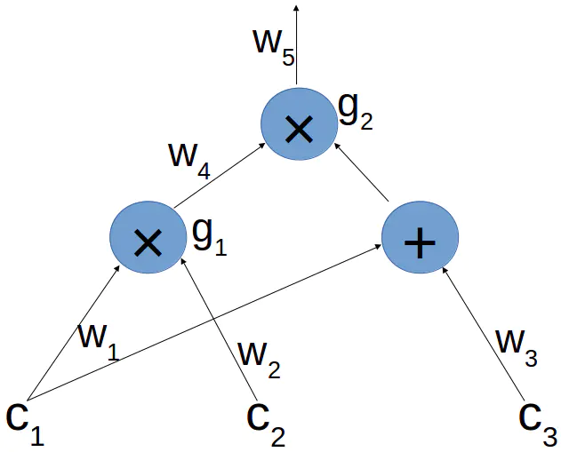

原文：[Zk-SNARKs: Under the Hood](https://medium.com/@VitalikButerin/zk-snarks-under-the-hood-b33151a013f6)

  <!--more-->

最近读了 Zcash 的零知识证明科普系列的文章，就在这里做一个总结，记录一下学习过程。

## 同态隐藏

同态隐藏的定义：`E(x)`是`x`的函数，该函数满足：

- 通过`E(x)`很难推算出`x`
- 不同的`x`会得到不同的`E(x)`值
- 如果知道`E(x)`和`E(y)`,那么就可以计算出`E(x+y)`。

为什么同态隐藏很有用呢？假设 Alice 想向 Bob 证明她知道 `x` 和 `y` 这两个数字，并且 `x+y=7`，可以这么做：

1. Alice 把`E(x)`和`E(y)`发送给 Bob
2. Bob 通过上面两个值，计算出`E(x+y)`。(因为`E`是同态隐藏函数，并且 Bob 也知道这个函数，所以 Bob 可以从`E(x)`和`E(y)`计算出`E(x+y)`)
3. Bob 也计算出`E(7)`,如果`E(x+y) == E(7)`，那么 Bob 就承认 Alice 知道`x`和`y`

## 多项式和线性组合

定义一个`d`次多项式P：
$$P(X) = a_0 + a_1*X + a_2 * X^2 + ... + a_d * X^d, 其中\ a_0, ..., a_d \in \mathbb{F}_p$$

我们可以这样在 $$s \in \mathbb{F}_p $$ 点上计算 P，让 s 代替 X，并计算总和:

$$P(s) = a_0 + a_1*s + a_2 * s^2 + ... + a_d * s^d$$。
 由上面的式子可以看出，P(s) 实际上也是$$1, s, ..., s^d$$这些值的`线性组合`，或者说成是`加权和`，他们的权重依次是$$a_0, ..., a_d$$。

在之前，我们看到同态隐藏函数 `E`是这么来定义的： E(x) = g^x，`g`是一个具有*离散对数难问题*的`生成元`。另外，这个同态隐藏函数还支持`加法`，也就是说，我们可以通过`E(x)`和`E(y)`计算出`E(x+y)`。我们需要注意的是，它其实也支持线性组合，也就是说，给定`a, b, E(x), E(y)`，我们可以计算出`E(ax+by)`。这是因为：
 $$E(ax+by) = g^{ax+by} = g^{ax} * g^{by} = (g^x)^a * (g^y)^b = E(x)^a * E(y)^b$$

## 多项式的盲计算

假设 Alice 有一个`d`次多项式`P`，Bob有一个随机的点`s`, $$s \in \mathbb{F}_p$$。如果 Bob 想要得出`E(P(s))`，那么他可以采用如下两种办法：

> 1. Alice把`P`发送给Bob，然后由Bob自己计算出`E(P(s))`
> 2. Bob发送`s`给Alice，她在计算出`E(P(s))`之后把结果发给Bob

然后，在盲式计算中，我们想让Bob在无法得知`P`的情况下得知到`E(P(s))`  —— 这就否定了第一种办法；但同时，更重要地，我们也不想让Alice得知`s`，这样也否定了第二种办法。

不过，我们可以用同态隐藏函数进行盲式计算，具体可以这样做：

1. Bob把隐藏数$$E(1),E(s),...,E(S^d)$$发送给Alice
2. Alice通过上面的隐藏数计算出`E(P(s))`，然后把结果发送给Bob(Alice之所以可以这么做，是因为`E`支持线性组合，而`P(s)`就是$$1, s, ..., s^d$$的线性组合)

你看，我们只发送隐藏数就可以了，Alice不需要得知`s`，Bob也不需要得知`P`。看起来我们好像很轻易的就解决了零知识证明所需要的需求，难道真的是这样吗？

当然不是，我们的确利用盲计算将繁琐的计算的过程外包给了他人，也得到了一个结果，但是 Alice 能计算出`E(P(x))`并不代表她会发送正确的`E(P(x))`给Bob，她可能会发送一些完全无关的数值。

## 系数知识测试

对于$$\alpha \in \mathbb{F}^*_p$$，  我们定义一个二元组：$$(a, b), a \in G, b \in G$$。如果$$a, b \neq 0且b = \alpha*a$$，那么我就称这个二元组为 $$\alpha$$二元组。

这个 KC 测试的过程是这样的：

1. Bob 随机选择$$\alpha \in \mathbb{F}^*_p和a \in G$$。然后计算出$$b = \alpha*a$$
2. 他把这个二元组(a, b)发给Alice，向Alice发起挑战。注意，(a, b)是一个$$\alpha$$二元组
3. Alice必须回应一个不同的$$\alpha$$二元组(a', b')
4. 只有当(a', b')确实是一个$$\alpha$$ 二元组时，Bob才接受Alice

现在，我们来思考一下，Alice应该如何回应这个测试。我们先随便假设一下，如果Alice知道$$\alpha$$，那么他就可以在G里面任意选择一个a'，然后计算出$$b'=\alpha*a'$$，并发送(a', b')。

然而，关于$$\alpha$$她唯一知道的只是$$\alpha * a$$，而G是具有离散对数难解问题的群，所以我们无法通过$$b = \alpha * a计算出\alpha$$。

那么，在不知道$$\alpha$$的情况下，她如何才能正确地回应这个测试呢？

有一个简单的办法：Alice只需要选择一个$$\gamma \in \mathbb{F}^*_p, 然后回应(a', b') = (\gamma * a, \gamma * b)$$

因此，我们有：
 $$b' = \gamma * b = \gamma \alpha * a = \alpha(\gamma*a)= \alpha * a'$$
 所以，(a', b')确实是一个$$\alpha$$二元组，符合要求。

需要注意的是，如果Alice通过这种情况来回应测试，那么她就知道了a和a'之间的比值，也就是说，她知道这么一个系数$$\gamma，满足a'=\gamma*a$$。

正如系数知识假设(KCA)所指出的那样，*这是不可避免的*，也就是说：
KCA： 如果Alice针对Bob的挑战(a, b)给予了一个正确的回应(a', b')，那么她就知道这样一个$$\gamma，满足a'=\gamma*a$$。

## 扩展的 KCA

现在，假设Bob不是发送了一个二元组，而是发送了多个$$\alpha二元组(a_1, b_1, ..., (a_d, b_d))$$(都是同样的$$\alpha$$)，那么，在Alice收到这些二元组之后，Alice需要生成另外的二元组(a', b')来完成这个挑战。请记住，Alice必须要能在不知道$$\alpha$$的情况下完成这个测试。

很自然地，Alice可以从这多个二元组中选择一个$$(a_i, b_i)$$出来，然后乘以某个c， $$c \in \mathbb{F}_p^*$$；如果 $$(a_i, b_i)$$ 是 $$\alpha$$ 二元组，那么（$$c*a_i,c*b_i$$）也一定是一个二元组。不过，Alice有没有别的方法生成$$\alpha$$二元组呢？是否可以同时利用几个收到的二元组生成一个新的？

答案是肯定的。例如，Alice可以选择两个值$$c_1, c_2 \in \mathbb{F}_p$$，然后计算出一个二元组$$(a', b') = (c_1*a_1 + c_2*a_2, c_1*b_1 + c_2*b_2)$$。这个可以进行简单的证明，只要a'不是0，那么这个二元组就是$$\alpha$$二元组：

$$b' = c_1*b_1+c_2 * b_2 = c_1\alpha*a_1 + c_2\alpha*a_2 = \alpha * (c_1*a_1+c_2*a_2) = \alpha * a'$$

更一般地，Alice可以使用给定的`d`个二元组的任意线性组合，也就是：对于任意的$$c_1, ..., c_d \in \mathbb{F}_p$$，可以定义：
 $$(a', b') = (\sum_{i=1}^d c_ia_i, \sum_{i=1}^dc_ib_i)$$。

注意，如果Alice用这个方法生成了她的$$\alpha$$二元组，她就会知道a'和$$a_1, ..., a_d$$之间的线性关系。也就是说，她知道$$c_1, ..., c_d使得a'=\sum_{i=1}^d c_i*a_i$$

这个扩展的KCA是指，Alice用这种方法生成二元组时，只要她成功了，她就知道a'和$$a_1, ..., a_d$$之间的线性关系。

更正式的表达是，假设G是一个大小为p的循环群，并且它的生成元是g，那么G的*d次系数知识假设(d-KCA)*可以表述为：

d-KCA： 设Bob随机选择$$\alpha \in \mathbb{F}_p^*和s \in \mathbb{F}_{p'}$$，并把如下的$$\alpha$$二元组发送给Alice$$(g, \alpha*g), (s*g, \alpha s*g), ..., (s^d*g, \alpha s^d*g)$$。如果Alice输出了另一组$$\alpha$$二元组(a', b')，那么Alice就会得知$$c_0, ..., c_d \in \mathbb{F}_p使得\sum_{i=0}^d c_is^i*g = a'$$。

OK，现在我们把上面介绍的各个部分整合一下。

## 可验证的多项式盲计算协议

假设我们的HH(同态隐藏函数)是：E(x) = x * g，g是上面循环群G的生成元。

由此，我们拿出我们的协议如下：

1. Bob选择了一个随机的$$\alpha \in \mathbb{F}_{p'}^*$$，并把$$(1, s, ..., s^d)的隐藏数(g, s*g, ..., s^d*g)$$，以及$$(\alpha, \alpha s, ..., \alpha s^d)的隐藏数(\alpha*g, \alpha s*g, ..., \alpha s^d *g)$$发送给Alice
2. Alice通过接收到的元素计算出$$a = P(s)*g以及b = \alpha P(s)*g$$，然后把结果发给Bob
3. Bob验证一下$$b = \alpha * a$$，如果满足这个等式，则接受Alice

首先，提醒一下，在给定了P的系数之后，$$P(s)*g是g, s*g, ..., s^d*g$$的线性组合，$$\alpha P(s)*g$$是$$\alpha * g, \alpha s*g, ..., \alpha s^d *g$$的线性组合，那么，根据之前的内容，Alice的确是可以从Bob发送的信息中计算出这些值的。

其次，通过 d-KCA 我们知道，在这整个过程中，Alice知道$$c_0, ..., c_d \in \mathbb{F}_p$$,使得$$a=\sum_{i=0}^d c_i s^i *g，因为a = P(s) *g$$，所以Alice知道这么一个多项式$$P(X) = \sum_{i=0}^d c_i*X^i$$。也就是说，假如Alice不知道这么个多项式，她瞎蒙一个结果能通过Bob的验证的可能性极小。

## 运算电路

假设，Alice想要向Bob证明她知道$$c_1, c_2, c_3 \in \mathbb{F}_p$$，并使得$$(c_1*c_2) * (c_1 + c_3) = 7$$。第一步，我们先把上面的计算转化一个运算电路。

针对电路的一个合法的赋值，是给被标记线的赋值，使得每个乘法门的输出值确实是相应输入的乘积。

因此，对于我们的电路，一个合乎规范的赋值形式是：$$(c_1,…,c_5) 其中 c_4=c_1*c_2 并且 c_5=c_4*(c_1+c_3) $$。

按照这种方式，Alice想要证明的是，她知道一组合法的赋值($$c_1, ..., c_5)，可以满足c_5=7$$。下一步，是使用 QAP 将这个语句翻译成一个多项式。

## QAP

我们将每个乘法门与域元素联系起来：$$g_1将与1 \in \mathbb{F}_p$$联系起来，$$g_2 与 2 \in \mathbb{F}_p$$ 联系起来。我们称点{1,2}为我们的目标点。现在，我们需要定义 “左线多项式”集合 $$L_1,…,L_5$$ , “右线多项式” 集合$$R_1,…,R_5$$ 以及 “输出多项式” 集合：$$O_1,…,O_5$$。

这些定义的想法是，非乘法门所涉及的多项式在目标点的取值一般为零。

具体来说，$$像w_1,w_2,w_4各自是g_1的左、右、和输出线$$；我们定义$$L_1=R_2=O_4=2-X$$，因为多项式2-X，根据$$g_1，在1点值是1，根据g_2$$，多项式在2点值是0。

注意到$$w_1 和 w_3都是g_2$$的右输入。因此我们同样定义$$L_4=R_1=R_3=O_5=X-1$$——因为，根据$$g_2$$，X-1在目标点2是1，而在另外一个点是0。

我们将其余的多项式都设置成零多项式。(即 $$L_2=L_3=L_5=R_2=R_4=R_5=O_1=O_2=O_3 = 0$$)

给定 ($$c_1,…,c_5$$) 固定值，我们用他们作为系数来定义一个左、右和输出的“和”多项式。也就是说，我们定义：

$$L := \sum_{i=1}^5 c_i * L_i, R := \sum_{i=1}^5 c_i * R_i, O := \sum_{i=1}^5 c_i * O_i$$

然后我们定义多项式 P := L * R - O

现在，在完成所有这些定义之后，核心点在于：当且仅当P在所有的目标点上等于0时， ($$c_1,…,c_5$$)才是一个对于电路的合法赋值。

我们已知：
 $$L(X) = \sum_{i=1}^5 c_i * L_i = c_1(2-X)+c_4(X-1)$$
 $$R(X) = \sum_{i=1}^5 c_i * R_i = c_1(X-1)+c_2(2-X)$$
 $$O(X) = \sum_{i=1}^5 c_i * R_i = c_4(2-X)+c_5(X-1)$$

让我们使用例子来验证一下。假设我们定义 L,R,O,P ，采用上述给出的$$c_1,…,c_5$$。让我们在目标点 1 上计算所有的这些多项式：

在所有的$$L_i$$中，只有$$L_1$$在1点上是非零的。因此我们有$$L(1)=c_1⋅L_1(1)=c_1$$。同样，我们可以得到$$R(1)=c_2 和 O(1)=c_4$$。

因此，$$P(1)=c_1*c_2-c_4$$。 类似的可以计算出： $$P(2)=c_4*(c_1+c_3)-c_5$$。

换句话说，当且仅当$$(c_1, ..., c_5)$$是一组正确的赋值的时候，P在所有的目标点为0

现在，我们使用下面的代数事实：对于一个多项式 P 和一个点 $$a \in \mathbb{F}_p$$，当且仅当多项式 X-a 可以整除 P 时，我们有 P(a) = 0 ，比如 P=(X - a) * H ，H是某个多项式。

定义目标多项式 T(X) := (X-1)*(X-2)，当且仅当$$(c_1,…,c_5)$$ 是一个合法的赋值时，我们有T 能整除 P。

根据上面的讨论，我们对于 QAP 做出如下定义：

一个 d 阶 m 大小的二次算术程序(QAP) Q，由多项式$$L_1,…,L_m, R_1,…,R_m, O_1,…,O_m$$ 和 一个d阶目标多项式 T 构成。

如果给($$c_1,…,c_m$$) 的赋值满足 Q，定义
 $$L:=\sum_{i=1}^m c_i⋅L_i$$
$$ R:=\sum_{i=1}^m c_i⋅R_i$$
$$ O:=\sum_{i=1}^m c_i⋅O_i$$
 和
 P:=L⋅R-O
 我们可以确定T可以整除P。

在这个语境中，Alice想要证明她知道一组赋值($$c_1,...,c_5$$)满足上述的QAP,并且$$c_5 = 7$$。

总之，我们已经看到，像“我知道$$c_1,c_2,c_3能满足(c_1⋅c_2)⋅(c_1+c_3)=7”$$这样的语句，是怎么样通过QAP被转换成等价的多项式语句的。

## Pinocchio 协议

如果Alice有一个正确的赋值，意思是，像上面那样定义 L,R,O,P ，则存在一个多项式H，使得 P = H * T 。特别地，对于任意 $$s \in \mathbb{F}_p$$，我们都有P(s) = H(s) * T(s)

现在假如Alice没有一个正确的赋值，但是她用一个不满足条件的赋值($$c_1,..., c_m$$)构造L, R, O, P，那么我们可以保证T不能整除P。这是说，对于任意一个阶次不大于d的多项式H，P, L, R, O, H都将是不同的多项式。注意，这里的P, L, R, O, H的阶次都最多不会超过2d。

现在我们可以用著名的 Schwartz-Zippel 定理了，它告诉我们，两个不同的阶次不大于2d的多项式，他们最多有2d个共同的点 $$s \in \mathbb{F}_p$$。因此，如果p比2d大很多，那么随机选择一个s就能满足P(s) = H(s) * T(s)的概率非常低。

于是可以草拟出下面这个可以验证Alice是否有一组正确赋值的协议：

1. Alice选择如下阶次不大于d的多项式：L, R, O, H。
2. Bob选择一个随机的点 $$s \in \mathbb{F}_{p}$$，并计算出E(T(s))。
3. Alice把那些多项式在点s处的隐藏数(E(L(s)), E(R(s)), E(O(s)), E(H(s)))发送给Bob。
4. Bob检查如下方程是否在s处成立：E(L(s) * R(s) - O(s)) = E(T(s) * H(s))

再强调一次，如果Alice没有一组正确的赋值，那么她所使用的方程大概率下在s点不能成立，因此，在这种情况，她将不能通过Bob的验证。

如果Alice没有一组正确的赋值，也并不意味着她不能找到任何的阶次不大于`d`的，并且满足如下条件的L,R,O,H：L * R - O = T * H。这仅仅是说她不能通过同一组赋值($$c_1, ..., c_m$$)得到这样的多项式: $$L:=\sum_{i=1}^m c_i*L_i, R:= \sum_{i=1}^m c_i* R_i, O := \sum_{i=1}^m c_i * O_i$$。

之前提到的可验证的多项式盲计算只能保证 Alice 使用了正确阶次的多项式 L，R，O，但不能保证他们是从过同一组赋值产生的。那么我们要如何解决这样的问题呢？

我们把多项式L, R, O组合成一个多项式F:
 $$F = L + X^{d+1} * R + X ^ {2(d+1)} * O$$

将R与$$X^{d+1}$$相乘、O与$$x^{2(d+1)}$$相乘的原因是，这样L, R, O的系数在F中不会混合：$$1, X, ..., X^d$$刚好是L的系数，后面d+1个系数$$x^{d+1}, ..., X^{2d+1}$$刚好是R的系数，最后d+1个系数是O的。

让我们用同样的方式把QAP中的多项式组合起来，给每个$$i \in {1, ..., m}$$定义一个多项式$$F_i$$，它的第一部分d+1个系数是$$L_i$$的系数，之后的是$$R_i$$的系数，再之后是$$Q_i$$的系数。也就是说，对于每个$$i \in {1, ..., m}$$，我们定义这个多项式：

$$F_i = L_i + X^{d+1} * R_i + X^{2(d+1)} * O_i$$

注意，当我们把两个$$F_i相加时，L_i, R_i, O_i$$也分别相加。例如：
$$F_1 + F_2 = (L_1 + L_2) + X^{d+1} * (R_1 + R_2) + X ^{2(d+1)} * (O_1 + O_2)$$。

更一般地，假设对于$$(c_1, ..., c_m)我们有F = \sum_{i=1} ^m c_i * F_i $$，那么我们将得到： $$L = \sum_{i=1}^m c_i * L_i, R = \sum_{i=1}^m c_i * R_i, O = \sum_{i=1}^m c_i * O_i$$，它们共用相同的($$c_1, ..., c_m$$)。换句话说，如果F是$$F_i$$的线性组合，那么L, R, O就确实是从同一组赋值得到的。

因此，Bob将会请Alice证明F是$$F_i$$的线性组合，这个过程和盲计算是类似的：

Bob选择一个随机的$$\beta \in \mathbb{F}_p^*$$，并把隐藏数$$E(\beta * F_i(s)), ..., E(\beta * F_m(s))$$发送给Alice，并请Alice发回$$E(\beta*F(s))$$。如果她成功了，根据扩展版本的KCA假设，就代表Alice知道如何对$$F_i$$进行线性组合，从而计算出F。

